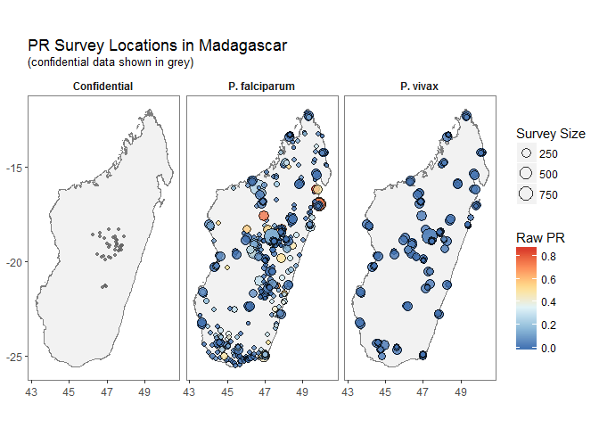
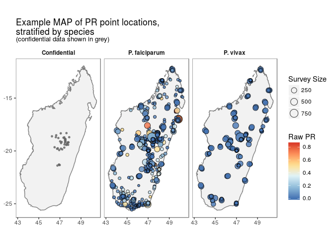
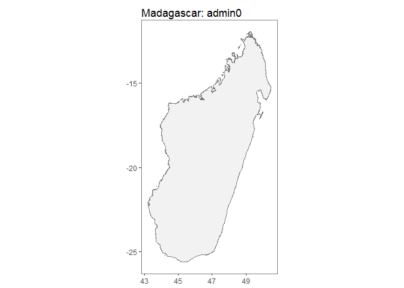
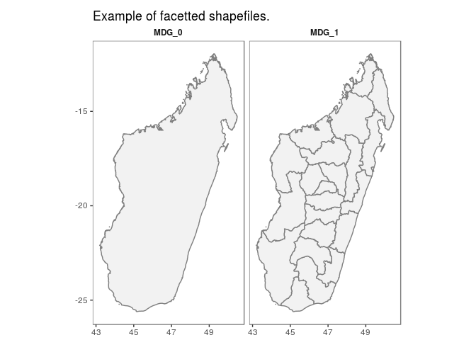
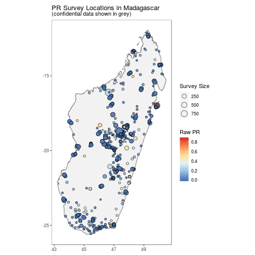
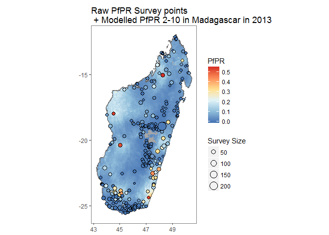

malariaAtlas
============

### An R interface to open-access malaria data, hosted by the Malaria Atlas Project.

Overview
========

This package allows you to download parasite rate data (*Plasmodium
falciparum* and *P. vivax*) and modelled raster outputs from the
[Malaria Atlas Project](https://map.ox.ac.uk/).

Available Data:
---------------

The data can be explored at <https://map.ox.ac.uk/explorer/#/explorer>.

### list\* Functions

`listData()` retrieves a list of available data to download.

Use:

-   listData(datatype = "points") OR listPoints() to see for which
    countries PR survey point data can be downloaded.

-   use listData(datatype = "rasters") OR listRaster() to see rasters
    available to download.

-   use listData(datatype = "shape") OR listShp() to see shapefiles
    available to download.

<!-- -->

    listData(datatype = "points")

    listData(datatype = "raster")

    listData(datatype = "shape")

### is\_available

`isAvailable` confirms whether or not PR survey point data is available
to download for a specified country.

Check whether PR data is available for Madagascar:

    isAvailable(country = "Madagascar")

    ## Confirming availability of PR data for: Madagascar...

    ## PR points are available for Madagascar.

Check whether PR data is available for the United States of America

    isAvailable(ISO = "USA")

    ## Confirming availability of PR data for: USA...

    ## Error in isAvailable(ISO = "USA"): Specified location not found, see below comments: 
    ##  
    ## Data not found for 'USA', did you mean UGA OR SAU?

Downloading & Visualising Data:
-------------------------------

### get\* functions & autoplot methods

### Parasite Rate Survey Points

`getPR()` downloads all publicly available PR data points for a
specified country and plasmodium species (Pf, Pv or BOTH) and returns
this as a dataframe with the following format:

    MDG_pr_data <- getPR(country = "Madagascar", species = "both")

    ## Observations: 1,793
    ## Variables: 28
    ## $ dhs_id                    <fct> , , , , , , , , , , , , , , , , , , ...
    ## $ site_id                   <int> 6221, 6021, 15070, 15795, 7374, 1309...
    ## $ site_name                 <fct> Andranomasina, Andasibe, Ambohimarin...
    ## $ latitude                  <dbl> -18.7170, -19.8340, -18.7340, -19.76...
    ## $ longitude                 <dbl> 47.4660, 47.8500, 47.2520, 46.6870, ...
    ## $ rural_urban               <fct> , , , , , , , , , , rural, , , , , r...
    ## $ country                   <fct> Madagascar, Madagascar, Madagascar, ...
    ## $ country_id                <fct> MDG, MDG, MDG, MDG, MDG, MDG, MDG, M...
    ## $ continent_id              <fct> Africa, Africa, Africa, Africa, Afri...
    ## $ month_start               <int> 1, 3, 1, 7, 4, 1, 1, 7, 4, 7, 11, 4,...
    ## $ year_start                <int> 1987, 1987, 1987, 1995, 1986, 1987, ...
    ## $ month_end                 <int> 1, 3, 1, 8, 6, 1, 1, 8, 4, 8, 11, 6,...
    ## $ year_end                  <int> 1987, 1987, 1987, 1995, 1986, 1987, ...
    ## $ lower_age                 <dbl> 0, 0, 0, 2, 7, 0, 0, 2, 6, 2, 2, 7, ...
    ## $ upper_age                 <int> 99, 99, 99, 9, 22, 99, 99, 9, 12, 9,...
    ## $ examined                  <int> 50, 246, 50, 50, 119, 50, 50, 50, 20...
    ## $ positive                  <dbl> 0.075, 126.000, 0.025, 0.060, 37.000...
    ## $ pr                        <dbl> 0.0015, 0.5122, 0.0005, 0.0012, 0.31...
    ## $ species                   <chr> "P. falciparum", "P. falciparum", "P...
    ## $ method                    <fct> Microscopy, Microscopy, Microscopy, ...
    ## $ rdt_type                  <fct> , , , , , , , , , , , , , , , , , , ...
    ## $ pcr_type                  <lgl> NA, NA, NA, NA, NA, NA, NA, NA, NA, ...
    ## $ malaria_metrics_available <fct> true, true, true, true, true, true, ...
    ## $ location_available        <fct> true, true, true, true, true, true, ...
    ## $ permissions_info          <fct> , , , , , , , , , , , , , , , , , , ...
    ## $ citation1                 <fct> Lepers, J.P., Ramanamirija, J.A., An...
    ## $ citation2                 <fct> , , , , , , , , , , , , , , , , , , ...
    ## $ citation3                 <lgl> NA, NA, NA, NA, NA, NA, NA, NA, NA, ...

`autoplot.pr.points` configures autoplot method to enable quick mapping
of the locations of downloaded PR points.

    autoplot(MDG_pr_data)

N.B. Facet-wrapped option is also available for species stratification.

    autoplot(MDG_pr_data,
             facet = TRUE,
             map_title = "Example MAP of PR point locations,\nstratified by species")

### Shapefiles

`getShp()` downloads a shapefile for a specified country (or countries)
and returns this as either a spatialPolygon or data.frame object.

    MDG_shp <- getShp(ISO = "MDG", admin_level = "both")

    ## Formal class 'SpatialPolygonsDataFrame' [package "sp"] with 5 slots
    ##   ..@ data       :'data.frame':  23 obs. of  8 variables:
    ##   .. ..$ gid          : int [1:23] 138 2790 2791 2792 2793 2794 2795 2796 2797 2798 ...
    ##   .. ..$ country_id   : Factor w/ 1 level "MDG": 1 1 1 1 1 1 1 1 1 1 ...
    ##   .. ..$ gaul_code    : int [1:23] 150 41750 41751 41752 41753 41754 41755 41756 41757 41758 ...
    ##   .. ..$ admn_level   : Factor w/ 2 levels "0","1": 1 2 2 2 2 2 2 2 2 2 ...
    ##   .. ..$ parent_id    : int [1:23] 0 150 150 150 150 150 150 150 150 150 ...
    ##   .. ..$ name         : Factor w/ 23 levels "Madagascar","Alaotra Mangoro",..: 1 2 3 4 5 6 7 8 9 10 ...
    ##   .. ..$ lsms_agri    : int [1:23] NA NA NA NA NA NA NA NA NA NA ...
    ##   .. ..$ country_level: chr [1:23] "MDG_0" "MDG_1" "MDG_1" "MDG_1" ...
    ##   ..@ polygons   :List of 23
    ##   .. ..$ :Formal class 'Polygons' [package "sp"] with 5 slots
    ##   .. ..$ :Formal class 'Polygons' [package "sp"] with 5 slots
    ##   .. ..$ :Formal class 'Polygons' [package "sp"] with 5 slots
    ##   .. ..$ :Formal class 'Polygons' [package "sp"] with 5 slots
    ##   .. ..$ :Formal class 'Polygons' [package "sp"] with 5 slots
    ##   .. ..$ :Formal class 'Polygons' [package "sp"] with 5 slots
    ##   .. ..$ :Formal class 'Polygons' [package "sp"] with 5 slots
    ##   .. ..$ :Formal class 'Polygons' [package "sp"] with 5 slots
    ##   .. ..$ :Formal class 'Polygons' [package "sp"] with 5 slots
    ##   .. ..$ :Formal class 'Polygons' [package "sp"] with 5 slots
    ##   .. ..$ :Formal class 'Polygons' [package "sp"] with 5 slots
    ##   .. ..$ :Formal class 'Polygons' [package "sp"] with 5 slots
    ##   .. ..$ :Formal class 'Polygons' [package "sp"] with 5 slots
    ##   .. ..$ :Formal class 'Polygons' [package "sp"] with 5 slots
    ##   .. ..$ :Formal class 'Polygons' [package "sp"] with 5 slots
    ##   .. ..$ :Formal class 'Polygons' [package "sp"] with 5 slots
    ##   .. ..$ :Formal class 'Polygons' [package "sp"] with 5 slots
    ##   .. ..$ :Formal class 'Polygons' [package "sp"] with 5 slots
    ##   .. ..$ :Formal class 'Polygons' [package "sp"] with 5 slots
    ##   .. ..$ :Formal class 'Polygons' [package "sp"] with 5 slots
    ##   .. ..$ :Formal class 'Polygons' [package "sp"] with 5 slots
    ##   .. ..$ :Formal class 'Polygons' [package "sp"] with 5 slots
    ##   .. ..$ :Formal class 'Polygons' [package "sp"] with 5 slots
    ##   ..@ plotOrder  : int [1:23] 1 8 21 19 18 7 12 11 2 5 ...
    ##   ..@ bbox       : num [1:2, 1:2] 43.2 -25.6 50.5 -11.9
    ##   .. ..- attr(*, "dimnames")=List of 2
    ##   ..@ proj4string:Formal class 'CRS' [package "sp"] with 1 slot

`autoplot.MAPshp` configures autoplot method to enable quick mapping of
downloaded shapefiles.

    MDG_shp <- as.MAPshp(MDG_shp)
    autoplot(MDG_shp)

N.B. Facet-wrapped option is also available for species stratification.

    autoplot(MDG_shp,
             facet = TRUE,
             map_title = "Example of facetted shapefiles.")

### Modelled Rasters

`getRaster()`downloads publicly available MAP rasters for a specific
surface & year, clipped to a given bounding box or shapefile

    MDG_shp <- getShp(ISO = "MDG", admin_level = "admin0")
    MDG_PfPR2_10 <- getRaster(surface = "Plasmodium falciparum PR2-10", shp = MDG_shp, year = 2013)

N.B. to use downloaded rasters and shapefiles directly with autoplot,
use as.MAPraster() and as.MAPshp() to convert these to data.frames.
Alternatively autoplot\_MAPraster() will work directly with RasterLayer,
RasterStack or RasterBrick objects downloaded with getRaster().

`autoplot.MAPraster`&`autoplot_MAPraster`configures autoplot method to
enable quick mapping of downloaded rasters.

    MDG_PfPR2_10_df <- as.MAPraster(MDG_PfPR2_10)
    MDG_shp_df <- as.MAPshp(MDG_shp)
    p <- autoplot(MDG_PfPR2_10_df, shp_df = MDG_shp_df)

### Combined visualisation

By using the above tools along with ggplot, simple comparison figures
can be easily produced.

    MDG_shp <- getShp(ISO = "MDG", admin_level = "admin0")
    MDG_shp_df <- as.MAPshp(MDG_shp)
    MDG_PfPR2_10 <- getRaster(surface = "Plasmodium falciparum PR2-10", shp = MDG_shp, year = 2013)
    MDG_PfPR2_10_df <- as.MAPraster(MDG_PfPR2_10)

    p <- autoplot(MDG_PfPR2_10_df, shp_df = MDG_shp_df, printed = FALSE)

    pr <- getPR(country = c("Madagascar"), species = "Pf")
    p[[1]] +
    geom_point(data = pr[pr$year_start==2013,], aes(longitude, latitude, fill = positive / examined, size = examined), shape = 21)+
    scale_size_continuous(name = "Survey Size")+
     scale_fill_distiller(name = "PfPR", palette = "RdYlBu")+
     ggtitle("Raw PfPR Survey points\n + Modelled PfPR 2-10 in Madagascar in 2013")

Basic Spatial utility tools
---------------------------

### extractRaster
