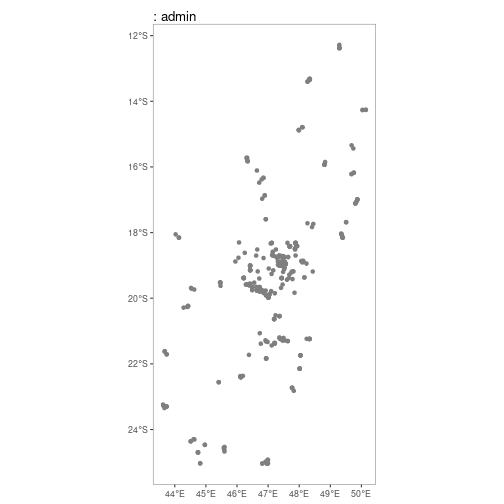
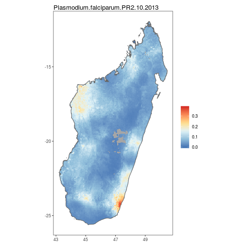
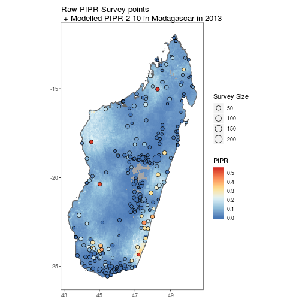
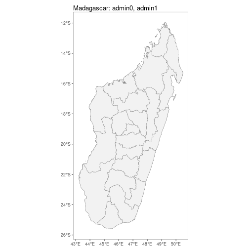
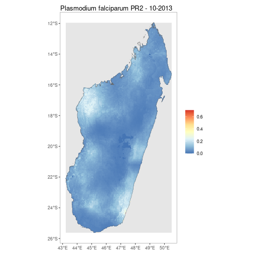
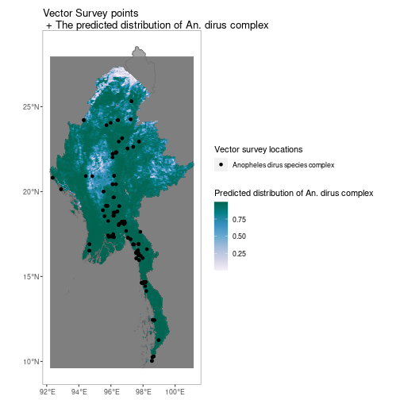

# malariaAtlas

### An R interface to open-access malaria data, hosted by the Malaria Atlas Project.

*The gitlab version of the malariaAtlas package has some additional bugfixes over the stable CRAN package. If you have any issues, try installing the latest github version. See below for instructions.*

# Overview

This package allows you to download parasite rate data (*Plasmodium falciparum* and *P. vivax*), survey occurrence data of the 41 dominant malaria vector species, and modelled raster outputs from the [Malaria Atlas Project](https://malariaatlas.org/).

More details and example analyses can be found in the [published paper)[(<https://malariajournal.biomedcentral.com/articles/10.1186/s12936-018-2500-5>).

## Available Data: 
The data can be explored at [https://data.malariaatlas.org/maps](https://data.malariaatlas.org/maps).

### List Versions Functions

The list version functions are used to list the available versions of different datasets, and all return a data.frame with a single column for version. These versions can be passed to functions such as `listShp`, `listSpecies`, `listPRPointCountries`, `listVecOccPointCountries`, `getPR`, `getVecOcc` and `getShp`.

Use:

-   `listPRPointVerions()` to see the available versions for PR point data, which can then be used in `listPRPointCountries` and `getPR`.

-   `listVecOccPointVersions()` to see the available versions for vector occurrence data, which can then be used in `listSpecies`, `listVecOccPointCountries` and `getVecOcc`.

-   `listShpVersions()` to see the available versions for admin unit shape data, which can then be used in `listShp` and `getShp`.


```r
listPRPointVersions()
```


```r
listVecOccPointVersions()
```


```r
listShpVersions()
```

### List Countries and Species Functions

To list the countries where there is available data for PR points or vector occurrence points, use:

-   `listPRPointCountries()` for PR points
-   `listVecOccPointCountries()` for vector occurrence points

To list the species available for vector point data use `listSpecies()`

All three of these functions can optionally take a version parameter (which can be found with the list versions functions). If you choose not to provide a version, the most recent version of the relevant dataset will be selected by default.


```r
listPRPointCountries(version = "202206")
```


```r
listVecOccPointCountries(version = "201201")
```


```r
listSpecies(version = "201201")
```

### List Administrative Units

To list administrative units for which shapefiles are stored on the MAP geoserver, use `listShp()`. Similar to the list countries and species functions, this function can optionally take a version.


```r
listShp(version = "202206")
```

### List Raster Function

`listRaster()` gets minimal information on all available rasters. It returns a data.frame with several columns for each raster such as dataset_id, title, abstract, min_raster_year and max_raster_year. The dataset_id can then be used in `getRaster` and `extractRaster`.


```r
listRaster()
```

### Is Available Functions

`isAvailable_pr` confirms whether or not PR survey point data is available to download for a specified country, ISO3 code or continent.

Check whether PR data is available for Madagascar:


```r
isAvailable_pr(country = "Madagascar")
```

Check whether PR data is available for the United States of America by ISO code:


```r
isAvailable_pr(ISO = "USA")
```

Check whether PR data is available for Asia:


```r
isAvailable_pr(continent = "Asia")
```

`isAvailable_vec` confirms whether or not vector survey point data is available to download for a specified country, ISO3 code or continent.

Check whether vector data is available for Myanmar:


```r
isAvailable_vec(country = "Myanmar")
```

Check whether vector data is available for multiple countries:


```r
isAvailable_vec(country = c("Nigeria", "Ethiopia"))
```

You can also pass these functions a dataset version. If you don't they will default to using the most recent version.


```r
isAvailable_pr(country = "Madagascar", version = "202206")
```

## Downloading & Visualising Data:

### get\* functions & autoplot methods

### Parasite Rate Survey Points

`getPR()` downloads all publicly available PR data points for a specified location (country, ISO, continent or extent) and plasmodium species (Pf, Pv or BOTH) and returns this as a dataframe with the following format:


```r
MDG_pr_data <- getPR(country = "Madagascar", species = "both")
```


```
## Rows: 395
## Columns: 28
## $ dhs_id                    <chr> NA, NA, NA, NA, NA, NA, NA, NA, NA, NA, NA, NA, NA, NA, NA, NA, NA, NA, NA, NA, NA, NA, NA, NA, NA, NA, N…
## $ site_id                   <int> 8689, 6221, 18093, 6021, 15070, 15795, 7374, 13099, 9849, 11961, 21475, 11572, 15943, 7930, 13748, 16323,…
## $ site_name                 <chr> "Vodivohitra", "Andranomasina", "Ankazobe", "Andasibe", "Ambohimarina", "Antohobe", "Ambohimazava", "Anke…
## $ latitude                  <dbl> -16.21700, -18.71700, -18.31600, -19.83400, -18.73400, -19.76990, -25.03230, -18.70100, -18.71920, -19.36…
## $ longitude                 <dbl> 49.68300, 47.46600, 47.11800, 47.85000, 47.25200, 46.68700, 46.99600, 47.16600, 47.49050, 48.16667, 47.46…
## $ rural_urban               <chr> "RURAL", "UNKNOWN", "RURAL", "UNKNOWN", "UNKNOWN", "UNKNOWN", "UNKNOWN", "UNKNOWN", "UNKNOWN", "UNKNOWN",…
## $ country                   <chr> "Madagascar", "Madagascar", "Madagascar", "Madagascar", "Madagascar", "Madagascar", "Madagascar", "Madaga…
## $ country_id                <chr> "MDG", "MDG", "MDG", "MDG", "MDG", "MDG", "MDG", "MDG", "MDG", "MDG", "MDG", "MDG", "MDG", "MDG", "MDG", …
## $ continent_id              <chr> "Africa", "Africa", "Africa", "Africa", "Africa", "Africa", "Africa", "Africa", "Africa", "Africa", "Afri…
## $ month_start               <int> 11, 1, 11, 3, 1, 7, 4, 1, 1, 2, 7, 11, 4, 7, 11, 4, 9, 7, 7, 3, 7, 7, 7, 11, 3, 4, 6, 3, 11, 11, 7, 7, 7,…
## $ year_start                <int> 1989, 1987, 1989, 1987, 1987, 1995, 1986, 1987, 1987, 2003, 1995, 1989, 1986, 1995, 1997, 1986, 1991, 199…
## $ month_end                 <int> 11, 1, 12, 3, 1, 8, 6, 1, 1, 2, 8, 12, 4, 8, 11, 6, 9, 8, 8, 6, 7, 7, 7, 12, 3, 6, 6, 6, 11, 11, 7, 8, 8,…
## $ year_end                  <int> 1989, 1987, 1989, 1987, 1987, 1995, 1986, 1987, 1987, 2003, 1995, 1989, 1986, 1995, 1997, 1986, 1991, 199…
## $ lower_age                 <dbl> 5, 0, 5, 0, 0, 2, 7, 0, 0, 0, 2, 5, 6, 2, 2, 7, 0, 2, 2, 0, 2, 0, 0, 5, 0, 7, 0, 0, 6, 5, 0, 2, 2, 2, 13,…
## $ upper_age                 <int> 15, 99, 15, 99, 99, 9, 22, 99, 99, 99, 9, 15, 12, 9, 9, 22, 99, 9, 9, 5, 9, 99, 99, 15, 99, 22, 99, 5, 12…
## $ examined                  <int> 165, 50, 258, 246, 50, 50, 119, 50, 50, 210, 50, 340, 20, 50, 61, 156, 104, 50, 50, 147, 147, 944, 541, 9…
## $ positive                  <dbl> 144.0, 7.5, 139.0, 126.0, 2.5, 6.0, 37.0, 13.5, 4.5, 34.0, 11.5, 255.0, 8.0, 7.0, 3.0, 97.0, 24.0, 33.0, …
## $ pr                        <dbl> 0.87272727, 0.15000000, 0.53875969, 0.51219512, 0.05000000, 0.12000000, 0.31092437, 0.27000000, 0.0900000…
## $ species                   <chr> "P. falciparum", "P. falciparum", "P. falciparum", "P. falciparum", "P. falciparum", "P. falciparum", "P.…
## $ method                    <chr> "Microscopy", "Microscopy", "Microscopy", "Microscopy", "Microscopy", "Microscopy", "Microscopy", "Micros…
## $ rdt_type                  <chr> NA, NA, NA, NA, NA, NA, NA, NA, NA, NA, NA, NA, NA, NA, NA, NA, NA, NA, NA, NA, NA, NA, NA, NA, NA, NA, N…
## $ pcr_type                  <chr> NA, NA, NA, NA, NA, NA, NA, NA, NA, NA, NA, NA, NA, NA, NA, NA, NA, NA, NA, NA, NA, NA, NA, NA, NA, NA, N…
## $ malaria_metrics_available <lgl> TRUE, TRUE, TRUE, TRUE, TRUE, TRUE, TRUE, TRUE, TRUE, TRUE, TRUE, TRUE, TRUE, TRUE, TRUE, TRUE, TRUE, TRU…
## $ location_available        <lgl> TRUE, TRUE, TRUE, TRUE, TRUE, TRUE, TRUE, TRUE, TRUE, TRUE, TRUE, TRUE, TRUE, TRUE, TRUE, TRUE, TRUE, TRU…
## $ permissions_info          <chr> NA, NA, NA, NA, NA, NA, NA, NA, NA, NA, NA, NA, NA, NA, NA, NA, NA, NA, NA, NA, NA, NA, NA, NA, NA, NA, N…
## $ citation1                 <chr> "Lepers, J.P. (1989). <i>Rapport sur la situation du paludisme dans la région de Mananara Nord.</i> . Ant…
## $ citation2                 <chr> NA, NA, NA, NA, NA, NA, NA, NA, NA, NA, NA, NA, NA, NA, NA, NA, NA, NA, NA, NA, NA, NA, NA, NA, NA, NA, N…
## $ citation3                 <chr> NA, NA, NA, NA, NA, NA, NA, NA, NA, NA, NA, NA, NA, NA, NA, NA, NA, NA, NA, NA, NA, NA, NA, NA, NA, NA, N…
```


```r
Africa_pvpr_data <- getPR(continent = "Africa", species = "Pv")
```


```r
Extent_pfpr_data <- getPR(extent = rbind(c(-2.460181, 13.581921), c(-3.867188, 34.277344)), species = "Pf")
```

You can also pass this function a dataset version. If you don't it will default to using the most recent version.


```r
MDG_pr_data_202206 <- getPR(country = "Madagascar", species = "both", version = "202206")
```

`autoplot.pr.points` configures autoplot method to enable quick mapping of the locations of downloaded PR points.


```r
autoplot(MDG_pr_data)
```



A version without facetting is also available.


```r
autoplot(MDG_pr_data,
         facet = FALSE)
```


### Vector Survey Points

`getVecOcc()` downloads all publicly available Vector survey points for a specified location (country, ISO, continent or extent) and species (options for which can be found with `listSpecies`) and returns this as a dataframe with the following format:


```r
MMR_vec_data <- getVecOcc(country = "Myanmar")
```


```
## Rows: 2,866
## Columns: 25
## $ id             <int> 1945, 1946, 1951, 1952, 790, 781, 772, 791, 773, 783, 774, 776, 777, 792, 778, 779, 780, 1953, 784, 785, 786, 788, 7…
## $ site_id        <int> 30243, 30243, 30243, 30243, 1000000072, 1000000071, 1000000071, 1000000072, 1000000071, 1000000071, 1000000071, 1000…
## $ latitude       <dbl> 16.2570, 16.2570, 16.2570, 16.2570, 17.3500, 17.3800, 17.3800, 17.3500, 17.3800, 17.3800, 17.3800, 17.3800, 17.3800,…
## $ longitude      <dbl> 97.7250, 97.7250, 97.7250, 97.7250, 96.0410, 96.0370, 96.0370, 96.0410, 96.0370, 96.0370, 96.0370, 96.0370, 96.0370,…
## $ country        <chr> "Myanmar", "Myanmar", "Myanmar", "Myanmar", "Myanmar", "Myanmar", "Myanmar", "Myanmar", "Myanmar", "Myanmar", "Myanm…
## $ country_id     <chr> "MMR", "MMR", "MMR", "MMR", "MMR", "MMR", "MMR", "MMR", "MMR", "MMR", "MMR", "MMR", "MMR", "MMR", "MMR", "MMR", "MMR…
## $ continent_id   <chr> "Asia", "Asia", "Asia", "Asia", "Asia", "Asia", "Asia", "Asia", "Asia", "Asia", "Asia", "Asia", "Asia", "Asia", "Asi…
## $ month_start    <int> 2, 3, 8, 9, 5, 5, 5, 5, 5, 5, 5, 5, 5, 5, 5, 5, 5, 10, 5, 5, 5, 5, 5, 5, 5, 5, 5, 5, 5, 5, 5, 5, 5, 5, 5, 5, 5, 5, 5…
## $ year_start     <int> 1998, 1998, 1998, 1998, 1998, 1998, 1998, 1998, 1998, 1998, 1998, 1998, 1998, 1998, 1998, 1998, 1998, 1998, 1998, 19…
## $ month_end      <int> 2, 3, 8, 9, 3, 3, 3, 3, 3, 3, 3, 3, 3, 3, 3, 3, 3, 10, 3, 3, 3, 3, 3, 3, 3, 3, 3, 3, 3, 3, 3, 3, 3, 3, 3, 3, 3, 3, 3…
## $ year_end       <int> 1998, 1998, 1998, 1998, 2000, 2000, 2000, 2000, 2000, 2000, 2000, 2000, 2000, 2000, 2000, 2000, 2000, 1998, 2000, 20…
## $ anopheline_id  <int> 17, 17, 17, 17, 50, 49, 17, 51, 11, 4, 15, 1, 35, 30, 50, 51, 30, 17, 17, 11, 15, 1, 35, 49, 4, 17, 11, 15, 1, 35, 5…
## $ species        <chr> "Anopheles dirus species complex", "Anopheles dirus species complex", "Anopheles dirus species complex", "Anopheles …
## $ species_plain  <chr> "Anopheles dirus", "Anopheles dirus", "Anopheles dirus", "Anopheles dirus", "Anopheles stephensi", "Anopheles sinens…
## $ id_method1     <chr> "unknown", "unknown", "unknown", "unknown", "morphology", "morphology", "morphology", "morphology", "morphology", "m…
## $ id_method2     <chr> NA, NA, NA, NA, NA, NA, NA, NA, NA, NA, NA, NA, NA, NA, NA, NA, NA, NA, NA, NA, NA, NA, NA, NA, NA, NA, NA, NA, NA, …
## $ sample_method1 <chr> "man biting", "man biting", "man biting", "man biting", "man biting indoors", "man biting indoors", "man biting indo…
## $ sample_method2 <chr> "animal baited net trap", "animal baited net trap", "animal baited net trap", "animal baited net trap", "man biting …
## $ sample_method3 <chr> NA, NA, NA, NA, "animal baited net trap", "animal baited net trap", "animal baited net trap", "animal baited net tra…
## $ sample_method4 <chr> NA, NA, NA, NA, "house resting inside", "house resting inside", "house resting inside", "house resting inside", "hou…
## $ assi           <chr> "", "", "", "", "", "", "", "", "", "", "", "", "", "", "", "", "", "", "", "", "", "", "", "", "", "", "", "", "", …
## $ citation       <chr> "Oo, T.T., Storch, V. and Becker, N. (2003).  <b><i>Anopheles</i> <i>dirus</i> and its role in malaria transmission …
## $ time_start     <date> 1998-02-01, 1998-03-01, 1998-08-01, 1998-09-01, 1998-05-01, 1998-05-01, 1998-05-01, 1998-05-01, 1998-05-01, 1998-05…
## $ time_end       <date> 1998-02-01, 1998-03-01, 1998-08-01, 1998-09-01, 2000-03-01, 2000-03-01, 2000-03-01, 2000-03-01, 2000-03-01, 2000-03…
## $ geometry       <POINT [°]> POINT (97.725 16.257), POINT (97.725 16.257), POINT (97.725 16.257), POINT (97.725 16.257), POINT (96.041 17.3…
```

You can also pass this function a dataset version. If you don't it will default to using the most recent version.


```r
MMR_vec_data_201201 <- getVecOcc(country = "Myanmar", version = "201201")
```

`autoplot.vector.points` configures autoplot method to enable quick mapping of the locations of downloaded vector points.


```r
autoplot(MMR_vec_data)
```



N.B. Facet-wrapped option is also available for species stratification.


```r
autoplot(MMR_vec_data,
         facet = TRUE)
```



### Shapefiles

`getShp()` downloads a shapefile for a specified country (or countries) and returns this as a simple feature object.


```r
MDG_shp <- getShp(ISO = "MDG", admin_level = c("admin0", "admin1"))
```


```
## Rows: 23
## Columns: 17
## $ iso           <chr> "MDG", "MDG", "MDG", "MDG", "MDG", "MDG", "MDG", "MDG", "MDG", "MDG", "MDG", "MDG", "MDG", "MDG", "MDG", "MDG", "MDG"…
## $ admn_level    <int> 0, 1, 1, 1, 1, 1, 1, 1, 1, 1, 1, 1, 1, 1, 1, 1, 1, 1, 1, 1, 1, 1, 1
## $ name_0        <chr> "Madagascar", "Madagascar", "Madagascar", "Madagascar", "Madagascar", "Madagascar", "Madagascar", "Madagascar", "Mada…
## $ id_0          <int> 10000910, 10000910, 10000910, 10000910, 10000910, 10000910, 10000910, 10000910, 10000910, 10000910, 10000910, 1000091…
## $ type_0        <chr> "Country", "Country", "Country", "Country", "Country", "Country", "Country", "Country", "Country", "Country", "Countr…
## $ name_1        <chr> NA, "Alaotra Mangoro", "Amoron I Mania", "Analamanga", "Analanjirofo", "Androy", "Anosy", "Atsimo Andrefana", "Atsimo…
## $ id_1          <int> NA, 10022998, 10022989, 10022983, 10022999, 10023001, 10023002, 10023003, 10022990, 10023000, 10022994, 10022995, 100…
## $ type_1        <chr> NA, "Region", "Region", "Region", "Region", "Region", "Region", "Region", "Region", "Region", "Region", "Region", "Re…
## $ name_2        <lgl> NA, NA, NA, NA, NA, NA, NA, NA, NA, NA, NA, NA, NA, NA, NA, NA, NA, NA, NA, NA, NA, NA, NA
## $ id_2          <lgl> NA, NA, NA, NA, NA, NA, NA, NA, NA, NA, NA, NA, NA, NA, NA, NA, NA, NA, NA, NA, NA, NA, NA
## $ type_2        <lgl> NA, NA, NA, NA, NA, NA, NA, NA, NA, NA, NA, NA, NA, NA, NA, NA, NA, NA, NA, NA, NA, NA, NA
## $ name_3        <lgl> NA, NA, NA, NA, NA, NA, NA, NA, NA, NA, NA, NA, NA, NA, NA, NA, NA, NA, NA, NA, NA, NA, NA
## $ id_3          <lgl> NA, NA, NA, NA, NA, NA, NA, NA, NA, NA, NA, NA, NA, NA, NA, NA, NA, NA, NA, NA, NA, NA, NA
## $ type_3        <lgl> NA, NA, NA, NA, NA, NA, NA, NA, NA, NA, NA, NA, NA, NA, NA, NA, NA, NA, NA, NA, NA, NA, NA
## $ source        <chr> "Madagascar NMCP 2016", "Madagascar NMCP 2016", "Madagascar NMCP 2016", "Madagascar NMCP 2016", "Madagascar NMCP 2016…
## $ country_level <chr> "MDG_0", "MDG_1", "MDG_1", "MDG_1", "MDG_1", "MDG_1", "MDG_1", "MDG_1", "MDG_1", "MDG_1", "MDG_1", "MDG_1", "MDG_1", …
## $ geometry      <MULTIPOLYGON [°]> MULTIPOLYGON (((44.2278 -25..., MULTIPOLYGON (((48.2394 -16..., MULTIPOLYGON (((45.7685 -19..., MULTIPOLYGON (((46.74…
```

`autoplot.sf` configures autoplot method to enable quick mapping of downloaded shapefiles.


```r
autoplot(MDG_shp)
```


N.B. Facet-wrapped option is also available for species stratification.


```r
autoplot(MDG_shp,
         facet = TRUE,
         map_title = "Example of facetted shapefiles.")
```



### Modelled Rasters

`getRaster()`downloads publicly available MAP rasters for a specific dataset_id & year, clipped to a given bounding box or shapefile


```r
MDG_shp <- getShp(ISO = "MDG", admin_level = "admin0")
MDG_PfPR2_10 <- getRaster(dataset_id = "Explorer__2020_Global_PfPR", shp = MDG_shp, year = 2013)
```

`autoplot.SpatRaster` & `autoplot.SpatRasterCollection` configures autoplot method to enable quick mapping of downloaded rasters.


```r
p <- autoplot(MDG_PfPR2_10, shp_df = MDG_shp)
```


### Combined visualisation

By using the above tools along with ggplot, simple comparison figures can be easily produced.


```r
MDG_shp <- getShp(ISO = "MDG", admin_level = "admin0")
MDG_PfPR2_10 <- getRaster(dataset_id = "Explorer__2020_Global_PfPR", shp = MDG_shp, year = 2013)

p <- autoplot(MDG_PfPR2_10, shp_df = MDG_shp, printed = FALSE)

pr <- getPR(country = c("Madagascar"), species = "Pf")
p[[1]] +
geom_point(data = pr[pr$year_start==2013,], aes(longitude, latitude, fill = positive / examined, size = examined), shape = 21)+
scale_size_continuous(name = "Survey Size")+
 scale_fill_distiller(name = "PfPR", palette = "RdYlBu")+
 ggtitle("Raw PfPR Survey points\n + Modelled PfPR 2-10 in Madagascar in 2013")
```



Similarly for vector survey data


```r
MMR_shp <- getShp(ISO = "MMR", admin_level = "admin0")
MMR_An_dirus <- getRaster(dataset_id = "Explorer__2010_Anopheles_dirus_complex", shp = MMR_shp)

p <- autoplot(MMR_An_dirus, shp_df = MMR_shp, printed = FALSE)

vec <- getVecOcc(country = c("Myanmar"), species = "Anopheles dirus")
p[[1]] +
geom_point(data = vec, aes(longitude, latitude, colour = species))+
  scale_colour_manual(values = "black", name = "Vector survey locations")+
 scale_fill_distiller(name = "Predicted distribution of An. dirus complex", palette = "PuBuGn", direction = 1)+
 ggtitle("Vector Survey points\n + The predicted distribution of An. dirus complex")
```



## Installation

### Latest stable version from CRAN

Just install using `install.packages("malariaAtlas")` or using the package manager in RStudio.

### Latest version from github

While this version is not as well-tested, it may include additional bugfixes not in the stable CRAN version. Install the `devtools` package and then install using `devtools::install_github('malaria-atlas-project/malariaAtlas')`
