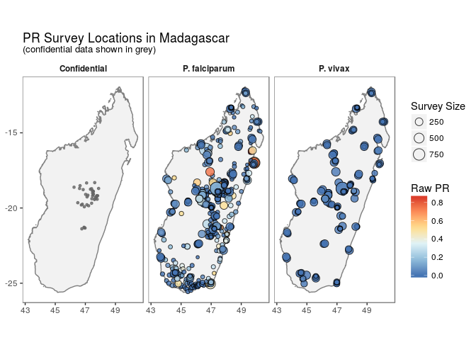
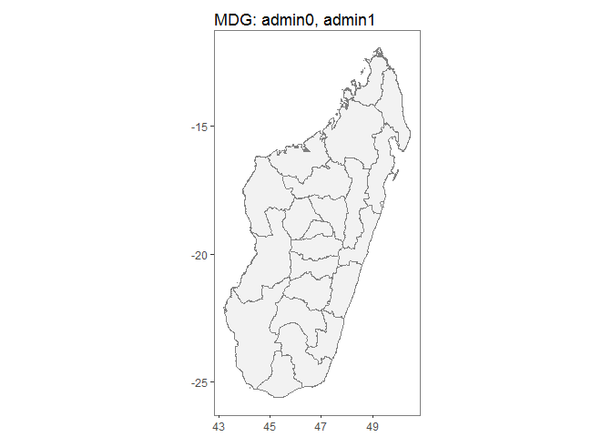
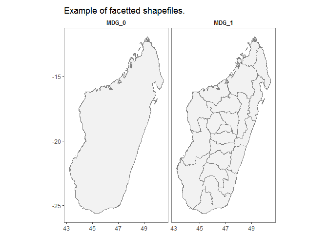
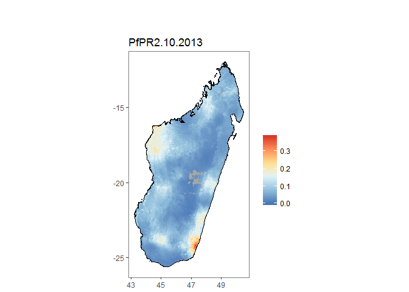

malariaAtlas
============

### An R interface to open-access malaria data, hosted by the Malaria Atlas Project.

Overview
========

*blurb re what the package is and what it does*

Available Data:
---------------

*blurb re what the data is and where it comes from*

### list\* Functions

`listData()` retrieves a list of available data to download.

Use:

-   listData(datatype = "points") OR listPoints() to see for which
    countries PR survey point data can be downloaded.

-   use listData(datatype = "rasters") OR listRaster()to see rasters
    available to download.

-   use listData(datatype = "shape") OR listShp() to see shapefiles
    available to download.

<!-- -->

    listData(datatype = "points")

    listData(datatype = "raster")

    listData(datatype = "shape")

### is\_available

`isAvailable` confirms whether or not PR survey point data is available
to download for a specified country.

Check whether PR data is available for Madagascar:

    isAvailable(country = "Madagascar")

    ## Confirming availability of PR data for: Madagascar...

    ## Data is available for Madagascar.

Check whether PR data is available for the United States of America

    isAvailable(ISO = "USA")

    ## Confirming availability of PR data for: USA...

    ## Error in isAvailable(ISO = "USA"): Specified countries not found, see below comments: 
    ##  
    ## Data not found for 'USA', did you mean UGA OR SAU?

Downloading & Visualising Data:
-------------------------------

### get\* functions & autoplot methods

### Parasite Rate Survey Points

`getPR()` downloads all publicly available PR data points for a
specified country and plasmodium species (Pf, Pv or BOTH) and returns
this as a dataframe with the following format:

    MDG_pr_data <- getPR(country = "Madagascar", species = "both")

    ## Observations: 905
    ## Variables: 29
    ## $ dhs_id                    <fctr> , , , , , , , , , , , , , , , , , ,...
    ## $ site_id                   <int> 16586, 2683, 8008, 8689, 16899, 2167...
    ## $ site_name                 <fctr> Tsarahasina, Manalalondo, Andafiats...
    ## $ latitude                  <dbl> -19.74900, -19.25900, -19.38400, -16...
    ## $ longitude                 <dbl> 46.79900, 47.11300, 47.66600, 49.683...
    ## $ rural_urban               <fctr> , , , rural, , , , rural, , , , , ,...
    ## $ country                   <fctr> Madagascar, Madagascar, Madagascar,...
    ## $ country_id                <fctr> MDG, MDG, MDG, MDG, MDG, MDG, MDG, ...
    ## $ continent_id              <fctr> Africa, Africa, Africa, Africa, Afr...
    ## $ month_start               <int> NA, NA, NA, 11, NA, NA, 1, 11, NA, 3...
    ## $ year_start                <int> NA, NA, NA, 1989, NA, NA, 1987, 1989...
    ## $ month_end                 <int> NA, NA, NA, 11, NA, NA, 1, 12, NA, 3...
    ## $ year_end                  <int> NA, NA, NA, 1989, NA, NA, 1987, 1989...
    ## $ lower_age                 <dbl> NA, NA, NA, 5, NA, NA, 0, 5, NA, 0, ...
    ## $ upper_age                 <int> NA, NA, NA, 15, NA, NA, 99, 15, NA, ...
    ## $ examined                  <int> NA, NA, NA, 165, NA, NA, 50, 258, NA...
    ## $ pf_pos                    <dbl> NA, NA, NA, 144.000, NA, NA, 0.075, ...
    ## $ pf_pr                     <dbl> NA, NA, NA, 0.87272727, NA, NA, 0.00...
    ## $ pv_pos                    <int> NA, NA, NA, 10, NA, NA, NA, 2, NA, N...
    ## $ pv_pr                     <dbl> NA, NA, NA, 0.06060606, NA, NA, NA, ...
    ## $ method                    <fctr> , , , Microscopy, , , Microscopy, M...
    ## $ rdt_type                  <fctr> , , , , , , , , , , , , , , , , , ,...
    ## $ pcr_type                  <lgl> NA, NA, NA, NA, NA, NA, NA, NA, NA, ...
    ## $ malaria_metrics_available <fctr> false, false, false, true, false, f...
    ## $ location_available        <fctr> true, true, true, true, true, true,...
    ## $ permissions_info          <fctr> No permission to release data, No p...
    ## $ citation1                 <fctr> Jambou, R., Ranaivo, L., Raharimala...
    ## $ citation2                 <fctr> Jambou, R. (2008) personal communic...
    ## $ citation3                 <lgl> NA, NA, NA, NA, NA, NA, NA, NA, NA, ...

`autoplot.pr.points` configures autoplot method to enable quick mapping
of the locations of downloaded PR points.

    autoplot(MDG_pr_data)

N.B. Facet-wrapped option is also available for species stratification.

    autoplot(MDG_pr_data,
             facet = TRUE,
             map_title = "Example MAP of PR point locations,\nstratified by species")

### Shapefiles

`getShp()` downloads a shapefile for a specified country (or countries)
and returns this as either a spatialPolygon or data.frame object.

    MDG_shp <- getShp(ISO = "MDG", admin_level = "both")

    ## Formal class 'SpatialPolygonsDataFrame' [package "sp"] with 5 slots
    ##   ..@ data       :'data.frame':  23 obs. of  6 variables:
    ##   .. ..$ NAME         : Factor w/ 23 levels "Madagascar","Alaotra Mangoro",..: 1 2 3 4 5 6 7 8 9 10 ...
    ##   .. ..$ COUNTRY_ID   : Factor w/ 1 level "MDG": 1 1 1 1 1 1 1 1 1 1 ...
    ##   .. ..$ GAUL_CODE    : int [1:23] 150 41750 41751 41752 41753 41754 41755 41756 41757 41758 ...
    ##   .. ..$ ADMN_LEVEL   : Factor w/ 2 levels "0","1": 1 2 2 2 2 2 2 2 2 2 ...
    ##   .. ..$ PARENT_ID    : int [1:23] 0 150 150 150 150 150 150 150 150 150 ...
    ##   .. ..$ country_level: chr [1:23] "MDG_0" "MDG_1" "MDG_1" "MDG_1" ...
    ##   ..@ polygons   :List of 23
    ##   .. ..$ :Formal class 'Polygons' [package "sp"] with 5 slots
    ##   .. ..$ :Formal class 'Polygons' [package "sp"] with 5 slots
    ##   .. ..$ :Formal class 'Polygons' [package "sp"] with 5 slots
    ##   .. ..$ :Formal class 'Polygons' [package "sp"] with 5 slots
    ##   .. ..$ :Formal class 'Polygons' [package "sp"] with 5 slots
    ##   .. ..$ :Formal class 'Polygons' [package "sp"] with 5 slots
    ##   .. ..$ :Formal class 'Polygons' [package "sp"] with 5 slots
    ##   .. ..$ :Formal class 'Polygons' [package "sp"] with 5 slots
    ##   .. ..$ :Formal class 'Polygons' [package "sp"] with 5 slots
    ##   .. ..$ :Formal class 'Polygons' [package "sp"] with 5 slots
    ##   .. ..$ :Formal class 'Polygons' [package "sp"] with 5 slots
    ##   .. ..$ :Formal class 'Polygons' [package "sp"] with 5 slots
    ##   .. ..$ :Formal class 'Polygons' [package "sp"] with 5 slots
    ##   .. ..$ :Formal class 'Polygons' [package "sp"] with 5 slots
    ##   .. ..$ :Formal class 'Polygons' [package "sp"] with 5 slots
    ##   .. ..$ :Formal class 'Polygons' [package "sp"] with 5 slots
    ##   .. ..$ :Formal class 'Polygons' [package "sp"] with 5 slots
    ##   .. ..$ :Formal class 'Polygons' [package "sp"] with 5 slots
    ##   .. ..$ :Formal class 'Polygons' [package "sp"] with 5 slots
    ##   .. ..$ :Formal class 'Polygons' [package "sp"] with 5 slots
    ##   .. ..$ :Formal class 'Polygons' [package "sp"] with 5 slots
    ##   .. ..$ :Formal class 'Polygons' [package "sp"] with 5 slots
    ##   .. ..$ :Formal class 'Polygons' [package "sp"] with 5 slots
    ##   ..@ plotOrder  : int [1:23] 1 8 21 19 18 7 12 11 2 5 ...
    ##   ..@ bbox       : num [1:2, 1:2] 43.2 -25.6 50.5 -11.9
    ##   .. ..- attr(*, "dimnames")=List of 2
    ##   ..@ proj4string:Formal class 'CRS' [package "sp"] with 1 slot

`autoplot.MAPshp` configures autoplot method to enable quick mapping of
downloaded shapefiles.

    MDG_shp <- as.MAPshp(MDG_shp)
    autoplot(MDG_shp)

N.B. Facet-wrapped option is also available for species stratification.

    autoplot(MDG_shp,
             facet = TRUE,
             map_title = "Example of facetted shapefiles.")

### Modelled Rasters

`getRaster()`downloads publicly available MAP rasters for a specific
surface & year, clipped to a given bounding box or shapefile

    MDG_shp <- getShp(ISO = "MDG", admin_level = "admin0")
    MDG_PfPR2_10 <- getRaster(surface = "PfPR2-10", shp = MDG_shp, year = 2013)

N.B. to use downloaded rasters and shapefiles directly with autoplot,
use as.MAPraster() and as.MAPshp() to convert these to data.frames.
Alternatively autoplot\_MAPraster() will work directly with RasterLayer,
RasterStack or RasterBrick objects downloaded with getRaster().

`autoplot.MAPraster`&`autoplot_MAPraster`configures autoplot method to
enable quick mapping of downloaded rasters.

    MDG_PfPR2_10_df <- as.MAPraster(MDG_PfPR2_10)
    MDG_shp_df <- as.MAPshp(MDG_shp)
    p <- autoplot(MDG_PfPR2_10_df, shp_df = MDG_shp_df)

    ## $`0`

### Combined visualisation

By using the above tools along with ggplot, simple comparison figures
can be easily produced.

    MDG_shp <- getShp(ISO = "MDG", admin_level = "admin0")
    MDG_shp_df <- as.MAPshp(MDG_shp)
    MDG_PfPR2_10 <- getRaster(surface = "PfPR2-10", shp = MDG_shp, year = 2013)
    MDG_PfPR2_10_df <- as.MAPraster(MDG_PfPR2_10)

    p <- autoplot(MDG_PfPR2_10_df, shp_df = MDG_shp_df, printed = FALSE)

    pr <- getPR(country = c("Madagascar"), species = "Pf")
    p[[1]] +
    geom_point(data = pr[pr$year_start==2013,], aes(longitude, latitude, fill = pf_pos / examined, size = examined), shape = 21)+
    scale_size_continuous(name = "Survey Size")+
     scale_fill_distiller(name = "PfPR", palette = "RdYlBu")+
     ggtitle("Raw PfPR Survey points\n + Modelled PfPR 2-10 in Madagascar in 2013")

Basic Spatial utility tools
---------------------------

### extractRaster

### zonalStats
