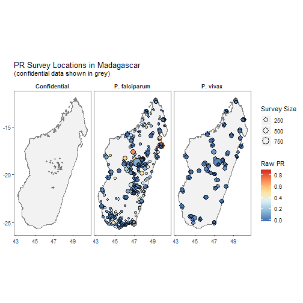
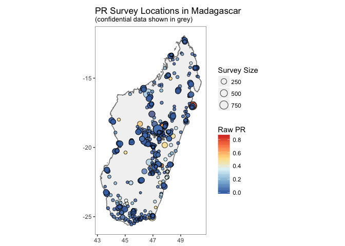
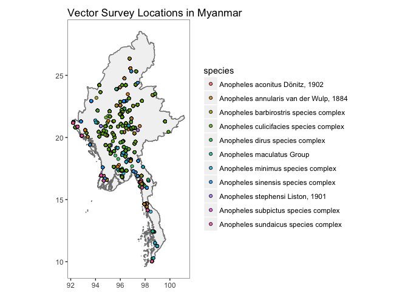
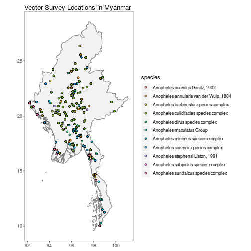
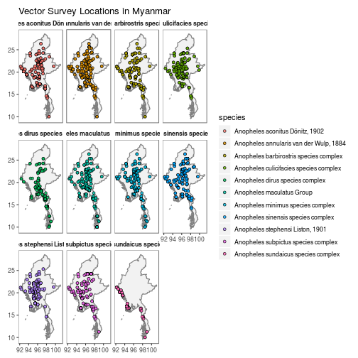
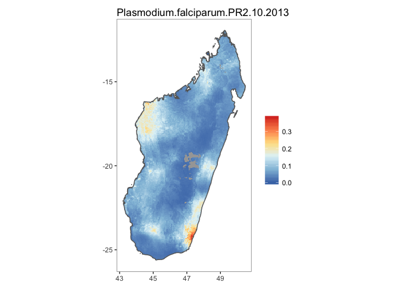
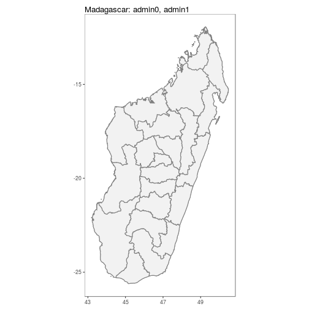
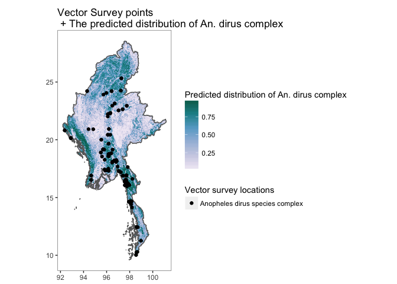

[](https://travis-ci.org/malaria-atlas-project/malariaAtlas)
[](https://codecov.io/gh/malaria-atlas-project/malariaAtlas?branch=master)


# malariaAtlas 
### An R interface to open-access malaria data, hosted by the Malaria Atlas Project. 

# Overview 

This package allows you to download parasite rate data (*Plasmodium falciparum* and *P. vivax*), suvery occurrence data of the 41 dominant malaria vector species, and modelled raster outputs from the [Malaria Atlas Project](https://map.ox.ac.uk/).


More details and example analyses can be found in the [published paper](https://malariajournal.biomedcentral.com/articles/10.1186/s12936-018-2500-5).


## Available Data: 
The data can be explored at [https://map.ox.ac.uk/explorer/#/explorer](https://map.ox.ac.uk/explorer/#/explorer).


### list* Functions


`listData()` retrieves a list of available data to download. 

Use: 

* listData(datatype = "pr points") OR listPoints(sourcedata = "pr points") to see for which countries PR survey point data can be downloaded.

* listData(datatype = "vector points") OR listPoints(sourcedata = "vector points") to see for which countries Vector survey data can be downloaded.

* use listData(datatype = "rasters") OR listRaster() to see rasters available to download. 

* use listData(datatype = "shape") OR listShp() to see shapefiles available to download. 


```r
listData(datatype = "pr points")
```

```r
listData(datatype = "vector points")
```

```r
listData(datatype = "raster")
```

```r
listData(datatype = "shape")
```

### is_available

`isAvailable_pr` confirms whether or not PR survey point data is available to download for a specified country. 

Check whether PR data is available for Madagascar:

```r
isAvailable_pr(country = "Madagascar")
```

```
## Confirming availability of PR data for: Madagascar...
```

```
## PR points are available for Madagascar.
```

Check whether PR data is available for the United States of America

```r
isAvailable_pr(ISO = "USA")
```

```
## Confirming availability of PR data for: USA...
```

```
## Error in isAvailable_pr(ISO = "USA"): Specified location not found, see below comments: 
##  
## Data not found for 'USA', did you mean UGA OR SAU?
```

`isAvailable_vec` confirms whether or not vector survey point data is available to download for a specified country. 

Check whether vector data is available for Myanmar:

```r
isAvailable_vec(country = "Myanmar")
```

```
## Confirming availability of Vector data for: Myanmar...
```

```
## Vector points are available for Myanmar.
```

## Downloading & Visualising Data: 
### get* functions & autoplot methods

### Parasite Rate Survey Points
`getPR()` downloads all publicly available PR data points for a specified country and plasmodium species (Pf, Pv or BOTH) and returns this as a dataframe with the following format: 


```r
MDG_pr_data <- getPR(country = "Madagascar", species = "both")
```

```
## Observations: 1,793
## Variables: 28
## $ dhs_id                    <fct> , , , , , , , , , , , , , , , , , , ...
## $ site_id                   <int> 6221, 6021, 15070, 15795, 7374, 1309...
## $ site_name                 <fct> Andranomasina, Andasibe, Ambohimarin...
## $ latitude                  <dbl> -18.7170, -19.8340, -18.7340, -19.76...
## $ longitude                 <dbl> 47.4660, 47.8500, 47.2520, 46.6870, ...
## $ rural_urban               <fct> , , , , , , , , , , rural, , , , , r...
## $ country                   <fct> Madagascar, Madagascar, Madagascar, ...
## $ country_id                <fct> MDG, MDG, MDG, MDG, MDG, MDG, MDG, M...
## $ continent_id              <fct> Africa, Africa, Africa, Africa, Afri...
## $ month_start               <int> 1, 3, 1, 7, 4, 1, 1, 7, 4, 7, 11, 4,...
## $ year_start                <int> 1987, 1987, 1987, 1995, 1986, 1987, ...
## $ month_end                 <int> 1, 3, 1, 8, 6, 1, 1, 8, 4, 8, 11, 6,...
## $ year_end                  <int> 1987, 1987, 1987, 1995, 1986, 1987, ...
## $ lower_age                 <dbl> 0, 0, 0, 2, 7, 0, 0, 2, 6, 2, 2, 7, ...
## $ upper_age                 <int> 99, 99, 99, 9, 22, 99, 99, 9, 12, 9,...
## $ examined                  <int> 50, 246, 50, 50, 119, 50, 50, 50, 20...
## $ positive                  <dbl> 0.075, 126.000, 0.025, 0.060, 37.000...
## $ pr                        <dbl> 0.0015, 0.5122, 0.0005, 0.0012, 0.31...
## $ species                   <chr> "P. falciparum", "P. falciparum", "P...
## $ method                    <fct> Microscopy, Microscopy, Microscopy, ...
## $ rdt_type                  <fct> , , , , , , , , , , , , , , , , , , ...
## $ pcr_type                  <lgl> NA, NA, NA, NA, NA, NA, NA, NA, NA, ...
## $ malaria_metrics_available <fct> true, true, true, true, true, true, ...
## $ location_available        <fct> true, true, true, true, true, true, ...
## $ permissions_info          <fct> , , , , , , , , , , , , , , , , , , ...
## $ citation1                 <fct> Lepers, J.P., Ramanamirija, J.A., An...
## $ citation2                 <fct> , , , , , , , , , , , , , , , , , , ...
## $ citation3                 <lgl> NA, NA, NA, NA, NA, NA, NA, NA, NA, ...
```


`autoplot.pr.points` configures autoplot method to enable quick mapping of the locations of downloaded PR points. 


```r
autoplot(MDG_pr_data)
```



A version without facetting is also available.

```r
autoplot(MDG_pr_data,
         facet = FALSE)
```



### Vector Survey Points
`getVecOcc()` downloads all publicly available Vector survey points for a specified country and  and returns this as a dataframe with the following format: 


```r
MMR_vec_data <- getVecOcc(country = "Myanmar")
```

```
## Observations: 2,866
## Variables: 24
## $ site_id        <int> 30243, 30243, 30243, 30243, 1000000072, 1000000...
## $ latitude       <dbl> 16.257, 16.257, 16.257, 16.257, 17.350, 17.380,...
## $ longitude      <dbl> 97.725, 97.725, 97.725, 97.725, 96.041, 96.037,...
## $ country        <fct> Myanmar, Myanmar, Myanmar, Myanmar, Myanmar, My...
## $ country_id     <fct> MMR, MMR, MMR, MMR, MMR, MMR, MMR, MMR, MMR, MM...
## $ continent_id   <fct> Asia, Asia, Asia, Asia, Asia, Asia, Asia, Asia,...
## $ month_start    <int> 2, 3, 8, 9, 5, 5, 5, 5, 5, 5, 5, 5, 5, 5, 5, 5,...
## $ year_start     <int> 1998, 1998, 1998, 1998, 1998, 1998, 1998, 1998,...
## $ month_end      <int> 2, 3, 8, 9, 3, 3, 3, 3, 3, 3, 3, 3, 3, 3, 3, 3,...
## $ year_end       <int> 1998, 1998, 1998, 1998, 2000, 2000, 2000, 2000,...
## $ anopheline_id  <int> 17, 17, 17, 17, 50, 49, 51, 4, 30, 17, 11, 15, ...
## $ species        <fct> Anopheles dirus species complex, Anopheles diru...
## $ species_plain  <fct> Anopheles dirus, Anopheles dirus, Anopheles dir...
## $ id_method1     <fct> unknown, unknown, unknown, unknown, morphology,...
## $ id_method2     <fct> , , , , , , , , , , , , , , , , , , , , , , , , 
## $ sample_method1 <fct> man biting, man biting, man biting, man biting,...
## $ sample_method2 <fct> animal baited net trap, animal baited net trap,...
## $ sample_method3 <fct> , , , , animal baited net trap, animal baited n...
## $ sample_method4 <fct> , , , , house resting inside, house resting ins...
## $ assi           <fct> , , , , , , , , , , , , , , , , , , , , , , , , 
## $ citation       <fct> Oo, T.T., Storch, V. and Becker, N. (2003).  <b...
## $ geom           <fct> POINT (16.257 97.725), POINT (16.257 97.725), P...
## $ time_start     <fct> 1998-02-01, 1998-03-01, 1998-08-01, 1998-09-01,...
## $ time_end       <fct> 1998-02-01, 1998-03-01, 1998-08-01, 1998-09-01,...
```

`autoplot.vector.points` configures autoplot method to enable quick mapping of the locations of downloaded vector points. 


```r
autoplot.vector.points(MMR_vec_data)
```



N.B. Facet-wrapped option is also available for species stratification. 

```r
autoplot(MMR_vec_data,
         facet = TRUE)
```


### Shapefiles
`getShp()` downloads a shapefile for a specified country (or countries) and returns this as either a spatialPolygon or data.frame object.


```r
MDG_shp <- getShp(ISO = "MDG", admin_level = c("admin0", "admin1"))
```

```
## OGR data source with driver: ESRI Shapefile 
## Source: "C:\Users\whgu0734\AppData\Local\Temp\RtmpkhqjpA/shp/shp1a64711977c4/mapadmin_0_2018.shp", layer: "mapadmin_0_2018"
## with 1 features
## It has 8 fields
## OGR data source with driver: ESRI Shapefile 
## Source: "C:\Users\whgu0734\AppData\Local\Temp\RtmpkhqjpA/shp/shp1a6412ff2b1c/mapadmin_1_2018.shp", layer: "mapadmin_1_2018"
## with 22 features
## It has 12 fields
```

```
## Formal class 'SpatialPolygonsDataFrame' [package "sp"] with 5 slots
##   ..@ data       :'data.frame':	23 obs. of  16 variables:
##   .. ..$ iso          : Factor w/ 1 level "MDG": 1 1 1 1 1 1 1 1 1 1 ...
##   .. ..$ admn_level   : num [1:23] 0 1 1 1 1 1 1 1 1 1 ...
##   .. ..$ name_0       : Factor w/ 1 level "Madagascar": 1 1 1 1 1 1 1 1 1 1 ...
##   .. ..$ id_0         : num [1:23] 1e+07 1e+07 1e+07 1e+07 1e+07 ...
##   .. ..$ type_0       : Factor w/ 1 level "Country": 1 1 1 1 1 1 1 1 1 1 ...
##   .. ..$ name_1       : chr [1:23] NA "Androy" "Anosy" "Atsimo Andrefana" ...
##   .. ..$ id_1         : num [1:23] NA 1e+07 1e+07 1e+07 1e+07 ...
##   .. ..$ type_1       : chr [1:23] NA "Region" "Region" "Region" ...
##   .. ..$ name_2       : logi [1:23] NA NA NA NA NA NA ...
##   .. ..$ id_2         : logi [1:23] NA NA NA NA NA NA ...
##   .. ..$ type_2       : logi [1:23] NA NA NA NA NA NA ...
##   .. ..$ name_3       : logi [1:23] NA NA NA NA NA NA ...
##   .. ..$ id_3         : logi [1:23] NA NA NA NA NA NA ...
##   .. ..$ type_3       : logi [1:23] NA NA NA NA NA NA ...
##   .. ..$ source       : Factor w/ 1 level "Madagascar NMCP 2016": 1 1 1 1 1 1 1 1 1 1 ...
##   .. ..$ country_level: chr [1:23] "MDG_0" "MDG_1" "MDG_1" "MDG_1" ...
##   ..@ polygons   :List of 23
##   .. ..$ :Formal class 'Polygons' [package "sp"] with 5 slots
##   .. ..$ :Formal class 'Polygons' [package "sp"] with 5 slots
##   .. ..$ :Formal class 'Polygons' [package "sp"] with 5 slots
##   .. ..$ :Formal class 'Polygons' [package "sp"] with 5 slots
##   .. ..$ :Formal class 'Polygons' [package "sp"] with 5 slots
##   .. ..$ :Formal class 'Polygons' [package "sp"] with 5 slots
##   .. ..$ :Formal class 'Polygons' [package "sp"] with 5 slots
##   .. ..$ :Formal class 'Polygons' [package "sp"] with 5 slots
##   .. ..$ :Formal class 'Polygons' [package "sp"] with 5 slots
##   .. ..$ :Formal class 'Polygons' [package "sp"] with 5 slots
##   .. ..$ :Formal class 'Polygons' [package "sp"] with 5 slots
##   .. ..$ :Formal class 'Polygons' [package "sp"] with 5 slots
##   .. ..$ :Formal class 'Polygons' [package "sp"] with 5 slots
##   .. ..$ :Formal class 'Polygons' [package "sp"] with 5 slots
##   .. ..$ :Formal class 'Polygons' [package "sp"] with 5 slots
##   .. ..$ :Formal class 'Polygons' [package "sp"] with 5 slots
##   .. ..$ :Formal class 'Polygons' [package "sp"] with 5 slots
##   .. ..$ :Formal class 'Polygons' [package "sp"] with 5 slots
##   .. ..$ :Formal class 'Polygons' [package "sp"] with 5 slots
##   .. ..$ :Formal class 'Polygons' [package "sp"] with 5 slots
##   .. ..$ :Formal class 'Polygons' [package "sp"] with 5 slots
##   .. ..$ :Formal class 'Polygons' [package "sp"] with 5 slots
##   .. ..$ :Formal class 'Polygons' [package "sp"] with 5 slots
##   ..@ plotOrder  : int [1:23] 1 4 17 15 14 3 8 7 20 12 ...
##   ..@ bbox       : num [1:2, 1:2] 43.2 -25.6 50.5 -11.9
##   .. ..- attr(*, "dimnames")=List of 2
##   ..@ proj4string:Formal class 'CRS' [package "sp"] with 1 slot
```

`autoplot.MAPshp` configures autoplot method to enable quick mapping of downloaded shapefiles.


```r
MDG_shp <- as.MAPshp(MDG_shp)
autoplot(MDG_shp)
```



N.B. Facet-wrapped option is also available for species stratification. 


```r
autoplot(MDG_shp,
         facet = TRUE,
         map_title = "Example of facetted shapefiles.")
```



### Modelled Rasters 

`getRaster()`downloads publicly available MAP rasters for a specific surface & year, clipped to a given bounding box or shapefile


```r
MDG_shp <- getShp(ISO = "MDG", admin_level = "admin0")
MDG_PfPR2_10 <- getRaster(surface = "Plasmodium falciparum PR2-10", shp = MDG_shp, year = 2013)
```
N.B. to use downloaded rasters and shapefiles directly with autoplot, use as.MAPraster() and as.MAPshp() to convert these to data.frames. Alternatively autoplot_MAPraster() will work directly with RasterLayer, RasterStack or RasterBrick objects downloaded with getRaster().

`autoplot.MAPraster`&`autoplot_MAPraster`configures autoplot method to enable quick mapping of downloaded rasters.


```r
MDG_PfPR2_10_df <- as.MAPraster(MDG_PfPR2_10)
MDG_shp_df <- as.MAPshp(MDG_shp)
p <- autoplot(MDG_PfPR2_10_df, shp_df = MDG_shp_df)
```




### Combined visualisation 

By using the above tools along with ggplot, simple comparison figures can be easily produced. 


```r
MDG_shp <- getShp(ISO = "MDG", admin_level = "admin0")
MDG_shp_df <- as.MAPshp(MDG_shp)
MDG_PfPR2_10 <- getRaster(surface = "Plasmodium falciparum PR2-10", shp = MDG_shp, year = 2013)
MDG_PfPR2_10_df <- as.MAPraster(MDG_PfPR2_10)

p <- autoplot(MDG_PfPR2_10_df, shp_df = MDG_shp_df, printed = FALSE)

pr <- getPR(country = c("Madagascar"), species = "Pf")
p[[1]] +
geom_point(data = pr[pr$year_start==2013,], aes(longitude, latitude, fill = positive / examined, size = examined), shape = 21)+
scale_size_continuous(name = "Survey Size")+
 scale_fill_distiller(name = "PfPR", palette = "RdYlBu")+
 ggtitle("Raw PfPR Survey points\n + Modelled PfPR 2-10 in Madagascar in 2013")
```



Similarly for vector survey data


```r
MMR_shp <- getShp(ISO = "MMR", admin_level = "admin0")
MMR_shp_df <- as.MAPshp(MMR_shp)
MMR_An_dirus <- getRaster(surface = "Anopheles dirus species complex", shp = MMR_shp)
MMR_An_dirus_df <- as.MAPraster(MMR_An_dirus)

p <- autoplot(MMR_An_dirus_df, shp_df = MMR_shp_df, printed = FALSE)

vec <- getVecOcc(country = c("Myanmar"), species = "Anopheles dirus")
p[[1]] +
geom_point(data = vec, aes(longitude, latitude, colour = species))+
  scale_colour_manual(values = "black", name = "Vector survey locations")+
 scale_fill_distiller(name = "Predicted distribution of An. dirus complex", palette = "PuBuGn", direction = 1)+
 ggtitle("Vector Survey points\n + The predicted distribution of An. dirus complex")
```



## Basic Spatial utility tools 

### extractRaster 


