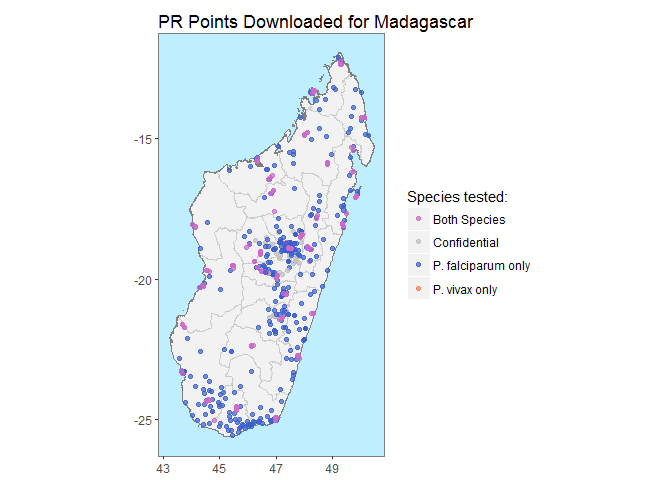
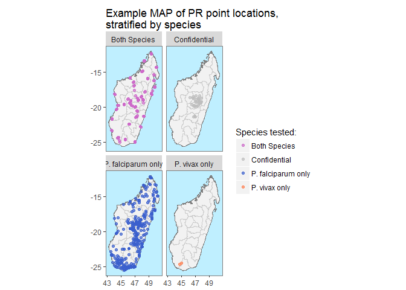

MAPdata
=======

A package that enables users to download publicly available Parasite
Rate Data from the Malaria Atlas Project geoserver.

Overview
--------

### PR Data Source

*blurb re what the data is and where it comes from*

### listAll

`listAll()` retrieves a list of countries for which Parasite Rate data
is available to download.

    listAll()

    ## Creating list of countries for which PR data is available, please wait...

    ## Countries with PR Data: 
    ##  Kenya (KEN) 
    ##  Afghanistan (AFG) 
    ##  Somalia (SOM) 
    ##  Indonesia (IDN) 
    ##  Zimbabwe (ZWE) 
    ##  Ethiopia (ETH) 
    ##  Burkina Faso (BFA) 
    ##  Madagascar (MDG) 
    ##  India (IND) 
    ##  Yemen (YEM) 
    ##  Tanzania (United Republic of) (TZA) 
    ##  Cambodia (KHM) 
    ##  Malawi (MWI) 
    ##  Zambia (ZMB) 
    ##  Senegal (SEN) 
    ##  Uganda (UGA) 
    ##  Bangladesh (BGD) 
    ##  Central African Republic (CAF) 
    ##  Colombia (COL) 
    ##  Togo (TGO) 
    ##  Sudan (SDN) 
    ##  Viet Nam (VNM) 
    ##  Mozambique (MOZ) 
    ##  Burundi (BDI) 
    ##  Papua New Guinea (PNG) 
    ##  Venezuela (VEN) 
    ##  Comoros (COM) 
    ##  Solomon Islands (SLB) 
    ##  Pakistan (PAK) 
    ##  Ghana (GHA) 
    ##  Guinea (GIN) 
    ##  Bolivia (BOL) 
    ##  Philippines (PHL) 
    ##  The Gambia (GMB) 
    ##  Niger (NER) 
    ##  Nigeria (NGA) 
    ##  Eritrea (ERI) 
    ##  Guinea-Bissau (GNB) 
    ##  Côte d'Ivoire (CIV) 
    ##  Nepal (NPL) 
    ##  Thailand (THA) 
    ##  Djibouti (DJI) 
    ##  Democratic Republic of the Congo (COD) 
    ##  South Africa (ZAF) 
    ##  Namibia (NAM) 
    ##  Vanuatu (VUT) 
    ##  China (CHN) 
    ##  Tajikistan (TJK) 
    ##  Botswana (BWA) 
    ##  Swaziland (SWZ) 
    ##  Brazil (BRA) 
    ##  Congo (COG) 
    ##  Cameroon (CMR) 
    ##  Equatorial Guinea (GNQ) 
    ##  Suriname (SUR) 
    ##  Liberia (LBR) 
    ##  Haiti (HTI) 
    ##  Myanmar (MMR) 
    ##  Mayotte (MYT) 
    ##  Benin (BEN) 
    ##  Cape Verde (CPV) 
    ##  Lao People's Democratic Republic (LAO) 
    ##  Malaysia (MYS) 
    ##  Peru (PER) 
    ##  Mali (MLI) 
    ##  Gabon (GAB) 
    ##  Sri Lanka (LKA) 
    ##  French Guiana (GUF) 
    ##  Iraq (IRQ) 
    ##  Saudi Arabia (SAU) 
    ##  Honduras (HND) 
    ##  São Tomé and Príncipe (STP) 
    ##  Turkey (TUR) 
    ##  Ecuador (ECU) 
    ##  South Sudan (SSD) 
    ##  Timor-Leste (TLS) 
    ##  Sierra Leone (SLE) 
    ##  Chad (TCD) 
    ##  Mauritania (MRT) 
    ##  Rwanda (RWA) 
    ##  Mexico (MEX) 
    ##  Costa Rica (CRI) 
    ##  Angola (AGO) 
    ##  Nicaragua (NIC) 
    ##  Bhutan (BTN)

### is\_available

`is_available` confirms whether or not PR data is available to download
for a specified country.

Check whether PR data is available for Madagascar:

    MAPdata::is_available(country = "Madagascar")

    ## Confirming availability of PR data for: Madagascar...

    ## Data is available for Madagascar.

Check whether PR data is available for the United States of America

    is_available(ISO = "USA")

    ## Confirming availability of PR data for: USA...

    ## Error in is_available(ISO = "USA"): Specified countries not found, see below comments: 
    ##  
    ## Data not found for 'USA', did you mean UGA OR SAU?

### getPR

`getPR()` downloads all publicly available PR data points for a
specified country and plasmodium species (Pf, Pv or BOTH) and returns
this as a dataframe with the following format:

    MDG_pr_data <- MAPdata::getPR(country = "Madagascar", species = "Both")

    ## Observations: 899
    ## Variables: 29
    ## $ dhs_id                    <fctr> , , , , , , , , , , , , , , , , , ,...
    ## $ site_id                   <int> 16586, 2683, 8008, 8689, 16899, 2167...
    ## $ site_name                 <fctr> Tsarahasina, Manalalondo, Andafiats...
    ## $ latitude                  <dbl> -19.74900, -19.25900, -19.38400, -16...
    ## $ longitude                 <dbl> 46.79900, 47.11300, 47.66600, 49.683...
    ## $ rural_urban               <fctr> , , , rural, , , , rural, , , , , ,...
    ## $ country                   <fctr> Madagascar, Madagascar, Madagascar,...
    ## $ country_id                <fctr> MDG, MDG, MDG, MDG, MDG, MDG, MDG, ...
    ## $ continent_id              <fctr> Africa, Africa, Africa, Africa, Afr...
    ## $ month_start               <int> NA, NA, NA, 11, NA, NA, 1, 11, NA, 3...
    ## $ year_start                <int> NA, NA, NA, 1989, NA, NA, 1987, 1989...
    ## $ month_end                 <int> NA, NA, NA, 11, NA, NA, 1, 12, NA, 3...
    ## $ year_end                  <int> NA, NA, NA, 1989, NA, NA, 1987, 1989...
    ## $ lower_age                 <dbl> NA, NA, NA, 5, NA, NA, 0, 5, NA, 0, ...
    ## $ upper_age                 <int> NA, NA, NA, 15, NA, NA, 99, 15, NA, ...
    ## $ examined                  <int> NA, NA, NA, 165, NA, NA, 50, 258, NA...
    ## $ pf_pos                    <dbl> NA, NA, NA, 144.0, NA, NA, 7.5, 139....
    ## $ pf_pr                     <dbl> NA, NA, NA, 0.87272727, NA, NA, 0.15...
    ## $ pv_pos                    <int> NA, NA, NA, 10, NA, NA, NA, 2, NA, N...
    ## $ pv_pr                     <dbl> NA, NA, NA, 0.06060606, NA, NA, NA, ...
    ## $ method                    <fctr> , , , Microscopy, , , Microscopy, M...
    ## $ rdt_type                  <fctr> , , , , , , , , , , , , , , , , , ,...
    ## $ pcr_type                  <lgl> NA, NA, NA, NA, NA, NA, NA, NA, NA, ...
    ## $ malaria_metrics_available <fctr> false, false, false, true, false, f...
    ## $ location_available        <fctr> true, true, true, true, true, true,...
    ## $ permissions_info          <fctr> No permission to release data, No p...
    ## $ citation1                 <fctr> Jambou, R., Ranaivo, L., Raharimala...
    ## $ citation2                 <fctr> Jambou, R. (2008) personal communic...
    ## $ citation3                 <lgl> NA, NA, NA, NA, NA, NA, NA, NA, NA, ...

### autoplot

`autoplot.pr.points` configures autoplot methods to enable quick mapping
of the locations of downloaded PR points.

    autoplot(MDG_pr_data)

N.B. Facet-wrapped option is also available for species stratification.

    autoplot(MDG_pr_data,
             facet = TRUE,
             map_title = "Example MAP of PR point locations,\nstratified by species")

