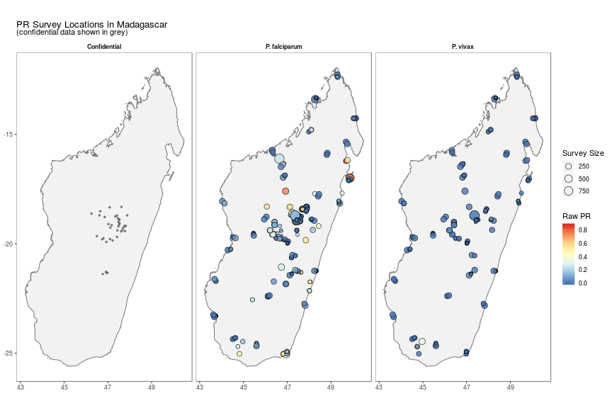
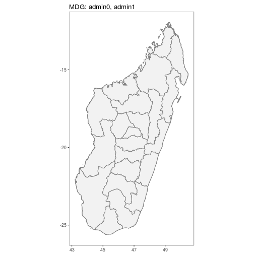
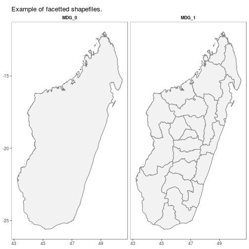
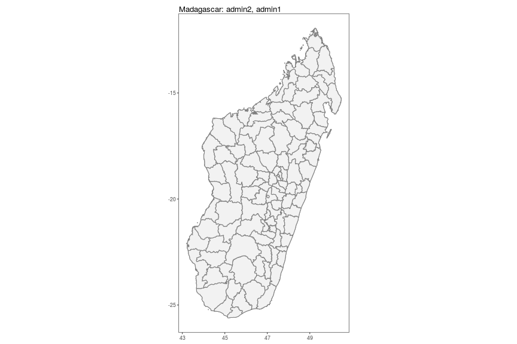
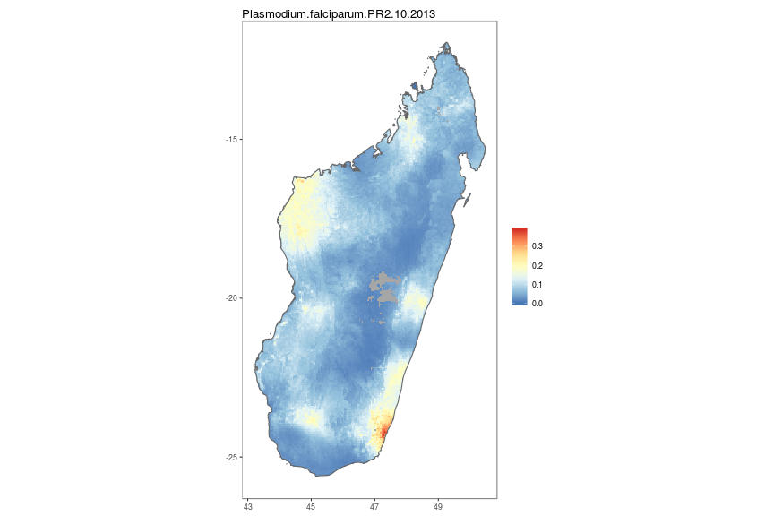
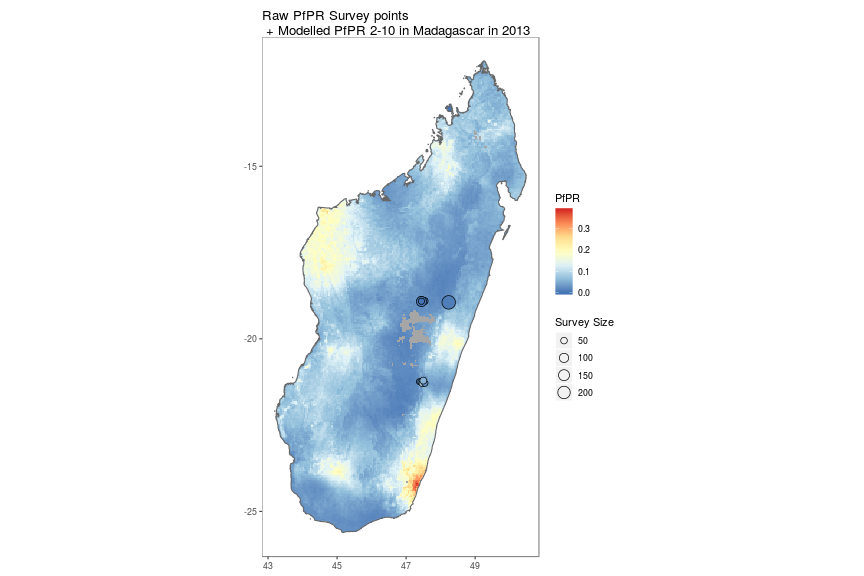
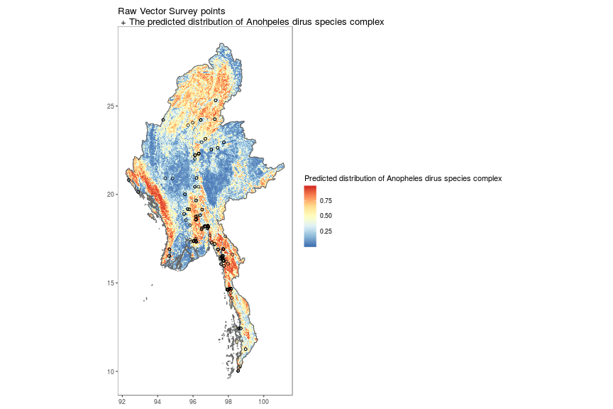

# Overview 

This package allows you to download parasite rate data (*Plasmodium falciparum* and *P. vivax*) and modelled raster outputs from the [Malaria Atlas Project](https://map.ox.ac.uk/).

## Available Data

The data can be interactively explored at [https://map.ox.ac.uk/explorer/#/explorer](https://map.ox.ac.uk/explorer/#/explorer).
This is also useful for finding information on the raster data available and checking the extents of different rasters (some are Africa only for example).


### list* Functions


`listData()` retrieves a list of available data to download. 

Use: 

* listData(datatype = "pr points") OR listPoints(sourcedata = "pr points") to see for which countries PR survey point data can be downloaded.

* use listData(datatype = "vector points") or listPoints(sourcedata = "vector points") to see for which countries Vector Occurrence data can be downloaded.

* use listData(datatype = "rasters") OR listRaster() to see rasters available to download. 

* use listData(datatype = "shape") OR listShp() to see shapefiles available to download. 


```r
library(malariaAtlas)
listData(datatype = "pr points")
```

```r
listData(datatype = "vector points")
```

```r
listData(datatype = "raster")
```

```r
listData(datatype = "shape")
```

### is_available

`isAvailable_pr` confirms whether or not PR survey point data is available to download for a specified country. 

Check whether PR data is available for Madagascar:

```r
isAvailable_pr(country = "Madagascar")
```

```
## Confirming availability of PR data for: Madagascar...
```

```
## PR points are available for Madagascar.
```

Check whether PR data is available for the United States of America

```r
isAvailable_pr(ISO = "USA")
```

```
## Confirming availability of PR data for: USA...
```

```
## Error in isAvailable_pr(ISO = "USA"): Specified location not found, see below comments: 
##  
## Data not found for 'USA', did you mean UGA OR SAU?
```

`isAvailable_vec` confirms whether or not Vector occurrence point data is available to download for a specified country. 

Check whether Vector occurrence data is available for Myanmar:

```r
isAvailable_vec(country = "Myanmar")
```

```
## Confirming availability of Vector data for: Myanmar...
```

```
## Vector points are available for Myanmar.
```

Check whether Vector occcurrence data is available for the Brazil

```r
isAvailable_vec(ISO = "BRA")
```

```
## Confirming availability of Vector data for: BRA...
```

```
## Vector points are available for BRA.
```

## Downloading & Visualising Data: 
### get* functions & autoplot methods

### Parasite Rate Survey Points
`getPR()` downloads all publicly available PR data points for a specified country and plasmodium species (Pf, Pv or BOTH) and returns this as a dataframe with the following format: 


```r
MDG_pr_data <- getPR(country = "Madagascar", species = "both")
```

```
## Observations: 538
## Variables: 28
## $ dhs_id                    <lgl> NA, NA, NA, NA, NA, NA, NA, NA, NA, NA…
## $ site_id                   <int> 6221, 6021, 15070, 15795, 7374, 13099,…
## $ site_name                 <fct> Andranomasina, Andasibe, Ambohimarina,…
## $ latitude                  <dbl> -18.7170, -19.8340, -18.7340, -19.7699…
## $ longitude                 <dbl> 47.4660, 47.8500, 47.2520, 46.6870, 46…
## $ rural_urban               <fct> UNKNOWN, UNKNOWN, UNKNOWN, UNKNOWN, UN…
## $ country                   <fct> Madagascar, Madagascar, Madagascar, Ma…
## $ country_id                <fct> MDG, MDG, MDG, MDG, MDG, MDG, MDG, MDG…
## $ continent_id              <fct> Africa, Africa, Africa, Africa, Africa…
## $ month_start               <int> 1, 3, 1, 7, 4, 1, 1, 7, 4, 7, 11, 4, 9…
## $ year_start                <int> 1987, 1987, 1987, 1995, 1986, 1987, 19…
## $ month_end                 <int> 1, 3, 1, 8, 6, 1, 1, 8, 4, 8, 11, 6, 9…
## $ year_end                  <int> 1987, 1987, 1987, 1995, 1986, 1987, 19…
## $ lower_age                 <int> 0, 0, 0, 2, 7, 0, 0, 2, 6, 2, 2, 7, 0,…
## $ upper_age                 <int> 99, 99, 99, 9, 22, 99, 99, 9, 12, 9, 9…
## $ examined                  <int> 50, 246, 50, 50, 119, 50, 50, 50, 20, …
## $ positive                  <dbl> 7.5, 126.0, 2.5, 6.0, 37.0, 13.5, 4.5,…
## $ pr                        <dbl> 0.1500, 0.5122, 0.0500, 0.1200, 0.3109…
## $ species                   <chr> "P. falciparum", "P. falciparum", "P. …
## $ method                    <fct> Microscopy, Microscopy, Microscopy, Mi…
## $ rdt_type                  <fct> , , , , , , , , , , , , , , , , , , , …
## $ pcr_type                  <lgl> NA, NA, NA, NA, NA, NA, NA, NA, NA, NA…
## $ malaria_metrics_available <fct> true, true, true, true, true, true, tr…
## $ location_available        <fct> true, true, true, true, true, true, tr…
## $ permissions_info          <fct> , , , , , , , , , , , , , , , , , , , …
## $ citation1                 <fct> "Lepers, J.P., Ramanamirija, J.A., And…
## $ citation2                 <fct> , , , , , , , , , , , , , , , , , , , …
## $ citation3                 <lgl> NA, NA, NA, NA, NA, NA, NA, NA, NA, NA…
```

### Vector Occurrnece points
`getVecOcc()` downloads all publicly available Vector Occurrence data points for a specified country and mosquito species (if required) and returns this as a dataframe with the following format: 


```r
MMR_vec_data <- getVecOcc(country = "Myanmar")
```

```
## Observations: 2,866
## Variables: 24
## $ site_id        <int> 30243, 30243, 30243, 30243, 1000000072, 100000007…
## $ latitude       <dbl> 16.257, 16.257, 16.257, 16.257, 17.350, 17.380, 1…
## $ longitude      <dbl> 97.725, 97.725, 97.725, 97.725, 96.041, 96.037, 9…
## $ country        <fct> Myanmar, Myanmar, Myanmar, Myanmar, Myanmar, Myan…
## $ country_id     <fct> MMR, MMR, MMR, MMR, MMR, MMR, MMR, MMR, MMR, MMR,…
## $ continent_id   <fct> Asia, Asia, Asia, Asia, Asia, Asia, Asia, Asia, A…
## $ month_start    <int> 2, 3, 8, 9, 5, 5, 5, 5, 5, 5, 5, 5, 5, 5, 5, 5, 5…
## $ year_start     <int> 1998, 1998, 1998, 1998, 1998, 1998, 1998, 1998, 1…
## $ month_end      <int> 2, 3, 8, 9, 3, 3, 3, 3, 3, 3, 3, 3, 3, 3, 3, 3, 3…
## $ year_end       <int> 1998, 1998, 1998, 1998, 2000, 2000, 2000, 2000, 2…
## $ anopheline_id  <int> 17, 17, 17, 17, 50, 49, 17, 51, 11, 4, 15, 1, 35,…
## $ species        <fct> "Anopheles dirus species complex", "Anopheles dir…
## $ species_plain  <fct> Anopheles dirus, Anopheles dirus, Anopheles dirus…
## $ id_method1     <fct> unknown, unknown, unknown, unknown, morphology, m…
## $ id_method2     <fct> , , , , , , , , , , , , , , , , , , , , , , , , 
## $ sample_method1 <fct> man biting, man biting, man biting, man biting, m…
## $ sample_method2 <fct> animal baited net trap, animal baited net trap, a…
## $ sample_method3 <fct> , , , , animal baited net trap, animal baited net…
## $ sample_method4 <fct> , , , , house resting inside, house resting insid…
## $ assi           <fct> , , , , , , , , , , , , , , , , , , , , , , , , 
## $ citation       <fct> "Oo, T.T., Storch, V. and Becker, N. (2003).  <b>…
## $ geom           <fct> POINT (16.257 97.725), POINT (16.257 97.725), POI…
## $ time_start     <fct> 1998-02-01, 1998-03-01, 1998-08-01, 1998-09-01, 1…
## $ time_end       <fct> 1998-02-01, 1998-03-01, 1998-08-01, 1998-09-01, 2…
```

`autoplot.pr.points` is an autoplot method to enable quick mapping of the locations of downloaded PR points. 


```r
autoplot(MDG_pr_data)
```



`autoplot.vector.points` is an autoplot method to enable quick mapping of the locations of downloaded vector occurrence points. 


```r
autoplot(MMR_vec_data)
```



Furthermore, being ggplot2 plots, these plots can easily be added to or modified.


```r
p <- autoplot(MDG_pr_data, printed = FALSE)
p + 
  scale_fill_gradientn(colours = rev(palettetown::pokepal('charmeleon', spread = 3))) +
  theme_minimal()
```




### Shapefiles
`getShp()` downloads a shapefile for a specified country (or countries) and returns this as either a spatialPolygon or data.frame object.


```r
MDG_shp <- getShp(ISO = "MDG", admin_level = c("admin1", "admin2"))
```

```
## OGR data source with driver: ESRI Shapefile 
## Source: "/tmp/RtmpICNGpC/shp/shp477c75b02ecf/mapadmin_1_2018.shp", layer: "mapadmin_1_2018"
## with 22 features
## It has 12 fields
## OGR data source with driver: ESRI Shapefile 
## Source: "/tmp/RtmpICNGpC/shp/shp477c3abc51dc/mapadmin_2_2018.shp", layer: "mapadmin_2_2018"
## with 114 features
## It has 16 fields
```

```
## Formal class 'SpatialPolygonsDataFrame' [package "sp"] with 5 slots
##   ..@ data       :'data.frame':	136 obs. of  16 variables:
##   .. ..$ iso          : Factor w/ 1 level "MDG": 1 1 1 1 1 1 1 1 1 1 ...
##   .. ..$ admn_level   : num [1:136] 1 1 1 1 1 1 1 1 1 1 ...
##   .. ..$ name_0       : Factor w/ 1 level "Madagascar": 1 1 1 1 1 1 1 1 1 1 ...
##   .. ..$ id_0         : num [1:136] 1e+07 1e+07 1e+07 1e+07 1e+07 ...
##   .. ..$ type_0       : Factor w/ 1 level "Country": 1 1 1 1 1 1 1 1 1 1 ...
##   .. ..$ name_1       : Factor w/ 22 levels "Alaotra Mangoro",..: 5 6 7 8 9 10 11 12 13 14 ...
##   .. ..$ id_1         : num [1:136] 1e+07 1e+07 1e+07 1e+07 1e+07 ...
##   .. ..$ type_1       : Factor w/ 1 level "Region": 1 1 1 1 1 1 1 1 1 1 ...
##   .. ..$ name_2       : chr [1:136] NA NA NA NA ...
##   .. ..$ id_2         : num [1:136] NA NA NA NA NA NA NA NA NA NA ...
##   .. ..$ type_2       : chr [1:136] NA NA NA NA ...
##   .. ..$ name_3       : logi [1:136] NA NA NA NA NA NA ...
##   .. ..$ id_3         : logi [1:136] NA NA NA NA NA NA ...
##   .. ..$ type_3       : logi [1:136] NA NA NA NA NA NA ...
##   .. ..$ source       : Factor w/ 1 level "Madagascar NMCP 2016": 1 1 1 1 1 1 1 1 1 1 ...
##   .. ..$ country_level: chr [1:136] "MDG_1" "MDG_1" "MDG_1" "MDG_1" ...
##   ..@ polygons   :List of 136
##   .. ..$ :Formal class 'Polygons' [package "sp"] with 5 slots
##   .. ..$ :Formal class 'Polygons' [package "sp"] with 5 slots
##   .. ..$ :Formal class 'Polygons' [package "sp"] with 5 slots
##   .. ..$ :Formal class 'Polygons' [package "sp"] with 5 slots
##   .. ..$ :Formal class 'Polygons' [package "sp"] with 5 slots
##   .. ..$ :Formal class 'Polygons' [package "sp"] with 5 slots
##   .. ..$ :Formal class 'Polygons' [package "sp"] with 5 slots
##   .. ..$ :Formal class 'Polygons' [package "sp"] with 5 slots
##   .. ..$ :Formal class 'Polygons' [package "sp"] with 5 slots
##   .. ..$ :Formal class 'Polygons' [package "sp"] with 5 slots
##   .. ..$ :Formal class 'Polygons' [package "sp"] with 5 slots
##   .. ..$ :Formal class 'Polygons' [package "sp"] with 5 slots
##   .. ..$ :Formal class 'Polygons' [package "sp"] with 5 slots
##   .. ..$ :Formal class 'Polygons' [package "sp"] with 5 slots
##   .. ..$ :Formal class 'Polygons' [package "sp"] with 5 slots
##   .. ..$ :Formal class 'Polygons' [package "sp"] with 5 slots
##   .. ..$ :Formal class 'Polygons' [package "sp"] with 5 slots
##   .. ..$ :Formal class 'Polygons' [package "sp"] with 5 slots
##   .. ..$ :Formal class 'Polygons' [package "sp"] with 5 slots
##   .. ..$ :Formal class 'Polygons' [package "sp"] with 5 slots
##   .. ..$ :Formal class 'Polygons' [package "sp"] with 5 slots
##   .. ..$ :Formal class 'Polygons' [package "sp"] with 5 slots
##   .. ..$ :Formal class 'Polygons' [package "sp"] with 5 slots
##   .. ..$ :Formal class 'Polygons' [package "sp"] with 5 slots
##   .. ..$ :Formal class 'Polygons' [package "sp"] with 5 slots
##   .. ..$ :Formal class 'Polygons' [package "sp"] with 5 slots
##   .. ..$ :Formal class 'Polygons' [package "sp"] with 5 slots
##   .. ..$ :Formal class 'Polygons' [package "sp"] with 5 slots
##   .. ..$ :Formal class 'Polygons' [package "sp"] with 5 slots
##   .. ..$ :Formal class 'Polygons' [package "sp"] with 5 slots
##   .. ..$ :Formal class 'Polygons' [package "sp"] with 5 slots
##   .. ..$ :Formal class 'Polygons' [package "sp"] with 5 slots
##   .. ..$ :Formal class 'Polygons' [package "sp"] with 5 slots
##   .. ..$ :Formal class 'Polygons' [package "sp"] with 5 slots
##   .. ..$ :Formal class 'Polygons' [package "sp"] with 5 slots
##   .. ..$ :Formal class 'Polygons' [package "sp"] with 5 slots
##   .. ..$ :Formal class 'Polygons' [package "sp"] with 5 slots
##   .. ..$ :Formal class 'Polygons' [package "sp"] with 5 slots
##   .. ..$ :Formal class 'Polygons' [package "sp"] with 5 slots
##   .. ..$ :Formal class 'Polygons' [package "sp"] with 5 slots
##   .. ..$ :Formal class 'Polygons' [package "sp"] with 5 slots
##   .. ..$ :Formal class 'Polygons' [package "sp"] with 5 slots
##   .. ..$ :Formal class 'Polygons' [package "sp"] with 5 slots
##   .. ..$ :Formal class 'Polygons' [package "sp"] with 5 slots
##   .. ..$ :Formal class 'Polygons' [package "sp"] with 5 slots
##   .. ..$ :Formal class 'Polygons' [package "sp"] with 5 slots
##   .. ..$ :Formal class 'Polygons' [package "sp"] with 5 slots
##   .. ..$ :Formal class 'Polygons' [package "sp"] with 5 slots
##   .. ..$ :Formal class 'Polygons' [package "sp"] with 5 slots
##   .. ..$ :Formal class 'Polygons' [package "sp"] with 5 slots
##   .. ..$ :Formal class 'Polygons' [package "sp"] with 5 slots
##   .. ..$ :Formal class 'Polygons' [package "sp"] with 5 slots
##   .. ..$ :Formal class 'Polygons' [package "sp"] with 5 slots
##   .. ..$ :Formal class 'Polygons' [package "sp"] with 5 slots
##   .. ..$ :Formal class 'Polygons' [package "sp"] with 5 slots
##   .. ..$ :Formal class 'Polygons' [package "sp"] with 5 slots
##   .. ..$ :Formal class 'Polygons' [package "sp"] with 5 slots
##   .. ..$ :Formal class 'Polygons' [package "sp"] with 5 slots
##   .. ..$ :Formal class 'Polygons' [package "sp"] with 5 slots
##   .. ..$ :Formal class 'Polygons' [package "sp"] with 5 slots
##   .. ..$ :Formal class 'Polygons' [package "sp"] with 5 slots
##   .. ..$ :Formal class 'Polygons' [package "sp"] with 5 slots
##   .. ..$ :Formal class 'Polygons' [package "sp"] with 5 slots
##   .. ..$ :Formal class 'Polygons' [package "sp"] with 5 slots
##   .. ..$ :Formal class 'Polygons' [package "sp"] with 5 slots
##   .. ..$ :Formal class 'Polygons' [package "sp"] with 5 slots
##   .. ..$ :Formal class 'Polygons' [package "sp"] with 5 slots
##   .. ..$ :Formal class 'Polygons' [package "sp"] with 5 slots
##   .. ..$ :Formal class 'Polygons' [package "sp"] with 5 slots
##   .. ..$ :Formal class 'Polygons' [package "sp"] with 5 slots
##   .. ..$ :Formal class 'Polygons' [package "sp"] with 5 slots
##   .. ..$ :Formal class 'Polygons' [package "sp"] with 5 slots
##   .. ..$ :Formal class 'Polygons' [package "sp"] with 5 slots
##   .. ..$ :Formal class 'Polygons' [package "sp"] with 5 slots
##   .. ..$ :Formal class 'Polygons' [package "sp"] with 5 slots
##   .. ..$ :Formal class 'Polygons' [package "sp"] with 5 slots
##   .. ..$ :Formal class 'Polygons' [package "sp"] with 5 slots
##   .. ..$ :Formal class 'Polygons' [package "sp"] with 5 slots
##   .. ..$ :Formal class 'Polygons' [package "sp"] with 5 slots
##   .. ..$ :Formal class 'Polygons' [package "sp"] with 5 slots
##   .. ..$ :Formal class 'Polygons' [package "sp"] with 5 slots
##   .. ..$ :Formal class 'Polygons' [package "sp"] with 5 slots
##   .. ..$ :Formal class 'Polygons' [package "sp"] with 5 slots
##   .. ..$ :Formal class 'Polygons' [package "sp"] with 5 slots
##   .. ..$ :Formal class 'Polygons' [package "sp"] with 5 slots
##   .. ..$ :Formal class 'Polygons' [package "sp"] with 5 slots
##   .. ..$ :Formal class 'Polygons' [package "sp"] with 5 slots
##   .. ..$ :Formal class 'Polygons' [package "sp"] with 5 slots
##   .. ..$ :Formal class 'Polygons' [package "sp"] with 5 slots
##   .. ..$ :Formal class 'Polygons' [package "sp"] with 5 slots
##   .. ..$ :Formal class 'Polygons' [package "sp"] with 5 slots
##   .. ..$ :Formal class 'Polygons' [package "sp"] with 5 slots
##   .. ..$ :Formal class 'Polygons' [package "sp"] with 5 slots
##   .. ..$ :Formal class 'Polygons' [package "sp"] with 5 slots
##   .. ..$ :Formal class 'Polygons' [package "sp"] with 5 slots
##   .. ..$ :Formal class 'Polygons' [package "sp"] with 5 slots
##   .. ..$ :Formal class 'Polygons' [package "sp"] with 5 slots
##   .. ..$ :Formal class 'Polygons' [package "sp"] with 5 slots
##   .. ..$ :Formal class 'Polygons' [package "sp"] with 5 slots
##   .. .. [list output truncated]
##   ..@ plotOrder  : int [1:136] 3 16 14 13 2 7 6 19 11 15 ...
##   ..@ bbox       : num [1:2, 1:2] 43.2 -25.6 50.5 -11.9
##   .. ..- attr(*, "dimnames")=List of 2
##   ..@ proj4string:Formal class 'CRS' [package "sp"] with 1 slot
```

`autoplot.MAPshp` configures autoplot method to enable quick mapping of downloaded shapefiles.


```r
MDG_shp <- as.MAPshp(MDG_shp)
autoplot(MDG_shp)
```



### Modelled Rasters 

`getRaster()`downloads publicly available MAP rasters for a specific surface & year, clipped to a given bounding box or shapefile


```r
MDG_shp <- getShp(ISO = "MDG", admin_level = "admin0")
MDG_PfPR2_10 <- getRaster(surface = "Plasmodium falciparum PR2-10", shp = MDG_shp, year = 2013)
```
N.B. to use downloaded rasters and shapefiles directly with autoplot, use as.MAPraster() and as.MAPshp() to convert these to data.frames. Alternatively autoplot_MAPraster() will work directly with RasterLayer, RasterStack or RasterBrick objects downloaded with getRaster().

`autoplot.MAPraster` and `autoplot_MAPraster` are autoplot methods to enable quick mapping of downloaded rasters.


```r
MDG_PfPR2_10_df <- as.MAPraster(MDG_PfPR2_10)
MDG_shp_df <- as.MAPshp(MDG_shp)
p <- autoplot(MDG_PfPR2_10_df, shp_df = MDG_shp_df)
```




### Combined visualisation 

By using the above tools along with ggplot, simple comparison figures can be easily produced. 


```r
MDG_shp <- getShp(ISO = "MDG", admin_level = "admin0")
MDG_shp_df <- as.MAPshp(MDG_shp)
MDG_PfPR2_10 <- getRaster(surface = "Plasmodium falciparum PR2-10", shp = MDG_shp, year = 2013)
MDG_PfPR2_10_df <- as.MAPraster(MDG_PfPR2_10)

p <- autoplot(MDG_PfPR2_10_df, shp_df = MDG_shp_df, printed = FALSE)

pr <- getPR(country = c("Madagascar"), species = "Pf")
p[[1]] +
geom_point(data = pr[pr$year_start==2013,], aes(longitude, latitude, fill = positive / examined, size = examined), shape = 21)+
scale_size_continuous(name = "Survey Size")+
 scale_fill_distiller(name = "PfPR", palette = "RdYlBu")+
 ggtitle("Raw PfPR Survey points\n + Modelled PfPR 2-10 in Madagascar in 2013")
```




```r
MMR_shp <- getShp(ISO = "MMR", admin_level = "admin0")
MMR_shp_df <- as.MAPshp(MMR_shp)
MMR_an_dirus <- getRaster(surface = "Anopheles dirus species complex", shp = MMR_shp)
MMR_an_dirus_df <- as.MAPraster(MMR_an_dirus)

p <- autoplot(MMR_an_dirus_df, shp_df = MMR_shp_df, printed = FALSE)

vec <- getVecOcc(country = c("Myanmar"), species = "Anopheles dirus")
p[[1]] +
geom_point(data = vec, aes(longitude, latitude), shape = 21,  show.legend = TRUE)+
  scale_fill_distiller(name = "Predicted distribution of Anopheles dirus species complex", palette = "RdYlBu")+
  ggtitle("Raw Vector Survey points\n + The predicted distribution of Anohpeles dirus species complex")
```



